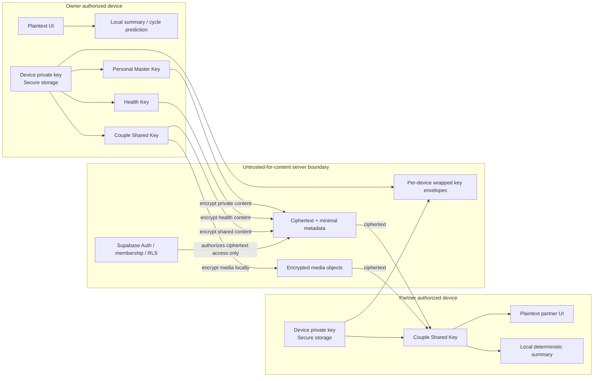

# 곰신로그 DATA & LEGAL RISK 검증 및 E2EE 아키텍처 결정서

- 감사일: 2026-08-11 (Asia/Seoul)
- 대상: `yesung23/gomsin-log`, `master` `1385c89`
- 방식: 저장소 정적 call-path 감사 + 연결된 Supabase 운영 프로젝트 읽기 전용 조회
- 코드 변경 범위: 본 결정서만 추가. Production 코드와 DB는 수정하지 않음

> 이 문서는 기술·개인정보 아키텍처 판단이다. 법률 자문을 대체하지 않으며, 공개 출시 전
> 개인정보보호 전문 변호사 또는 전문기관의 최종 검토가 필요하다.

## A. Executive decision

곰신로그에는 **Full User-Content E2EE + Minimal Server Metadata**를 권장한다.

이는 DB 전체를 암호화한다는 뜻이 아니다. 계정, 커플 멤버십, 객체 ID, 동기화 버전처럼
서버가 권한과 동기화를 위해 반드시 알아야 하는 최소 메타데이터는 서버에 남기고, 사용자가
작성하거나 업로드한 Tier 2·Tier 3 원문을 일관되게 E2EE로 보호한다.

- Tier 2: 기록 본문, 공유·비공개 기록, 사진·영상·음성, 일정·할 일·여행의 제목·주소·메모
- Tier 3: 생리 기간, 증상, 출혈량, 통증, 기분, 건강 메모
- 기본 요약과 감정 흐름은 권한이 있는 기기에서 복호화한 뒤 로컬에서 결정적으로 계산한다.
- Health Key는 파트너에게 전달하지 않는다.
- 파트너에게 보여 줄 주기 배려 정보는 소유자 기기에서 최소 projection으로 만든 뒤 별도
  Couple Shared Key로 암호화한다.
- 서버 또는 운영자가 모든 원문을 복구할 수 있는 master secret은 두지 않는다.

이 선택은 법이 E2EE를 명시적으로 강제해서가 아니다. 곰신로그의 핵심 데이터가 사적인
관계 기록과 건강정보이고, 침해 시 피해가 큰 반면 기본 요약을 이미 기기에서 계산하므로
서버 평문의 제품상 필요가 낮기 때문이다. E2EE는 **Product Privacy Decision이자 Security
Best Practice**이며, 개인정보 보호법의 별도 동의·안전조치·파기·국외이전 고지 의무를
대체하지 않는다.

## B. Terra audit corrections

첨부 파일에는 실제 Terra 보고서 본문 대신 `[여기에 Terra 감사 결과 전체를 붙여넣어라]`가
남아 있다. 따라서 존재하지 않는 문장을 인용해 판정하지 않고, 첨부가 지정한 주요 주장과
직전 보고서의 핵심 주장만 독립 검증했다.

| 주장 | 판정 | 실제 증거와 정정 |
|---|---|---|
| `daily_records`가 서버 plaintext다 | VERIFIED | `log_text TEXT`, `emotion_flow JSONB`, `attachments JSONB`; `saveRecordToDB()`가 암호화 없이 직접 upsert한다. E2EE 구현 검색 결과는 설계 문서 외 0건이다. |
| `briefings`가 오늘 요약 캐시로 실제 생성·갱신된다 | INCORRECT | 테이블과 수신자 SELECT 정책은 존재하지만, production client/Edge Function에 read/write call path가 0개이고 원격 행 수도 0이다. 실제 `generateDailySummary()`와 `buildCallBriefing()`은 메모리에서 실행된다. |
| 주기 원본은 `cycle_periods`/`cycle_daily_logs`에 분리되어 본인만 접근한다 | VERIFIED | `CycleTrackerSection`은 V3 API만 호출한다. 원격 RLS는 두 테이블 모두 `user_id = auth.uid()`이다. 파트너는 consent-gated projection RPC만 호출한다. |
| legacy 주기 데이터가 잔존한다 | VERIFIED | 운영 DB count: `cycle_entries=5`, `legacy_cycle_entries_backup=5`, V3 periods 2, daily logs 4. 신규 UI에서는 legacy API를 호출하지 않는다. |
| `couple-media`는 private bucket이다 | VERIFIED | 운영 Dashboard/SQL에서 `public=false` 확인. 현재 객체 수는 0이다. |
| Storage 최종 RLS가 INSERT/SELECT/DELETE를 모두 보호한다 | INCORRECT | **운영 DB에는 INSERT 정책 1개만 존재한다. SELECT와 DELETE 정책은 없다.** 저장소의 007에는 세 정책이 있으나 원격 최종 상태와 다르다. |
| signed URL 경로가 구현되어 있다 | PARTIALLY VERIFIED | `createSignedUrls()`와 1시간 TTL, canonical path 검증은 구현됨. 그러나 운영 SELECT 정책 부재로 인증 사용자의 서명 URL 발급은 정상 작동할 수 없다. |
| IndexedDB outbox에는 민감 원문이 없다 | INCORRECT | `QueuedRecord`는 기록 본문·감정·첨부 메타데이터와 원본 `File[]`, `userId`, `coupleId`를 앱 수준 암호화 없이 저장한다. |
| 앱 localStorage에 기록·주기 원문이 저장된다 | INCORRECT | 앱 자체 저장은 테마·위젯·설치 안내, 계정별 장식 사진, 동의 캐시, 삭제복구 플래그, 요약 checkpoint의 record ID다. 기록·일정·주기 원문은 앱 localStorage whitelist에 없다. 단 Supabase `persistSession:true`로 토큰과 계정 식별정보는 localStorage에 남는다. |
| 계정 삭제가 DB·Storage·Auth를 모두 지운다 | PARTIALLY VERIFIED | local source는 Storage 제거·확인 → service-role DB RPC → Auth 삭제 순서다. 운영 Edge Function 배포와 winning RPC 정의는 확인했다. 실제 삭제를 이번 감사에서 실행하지 않았고 배포 함수와 로컬 source의 byte parity는 확인하지 못했다. |
| Edge Function이 service role을 사용한다 | VERIFIED (source/config) | source는 `SUPABASE_SERVICE_ROLE_KEY`로 admin client를 만들고, 운영에는 기본 service-role secret과 `ALLOWED_ORIGINS` custom secret이 존재한다. 값은 열람하지 않았다. |
| 모든 SECURITY DEFINER가 안전한 최종 상태다 | PARTIALLY VERIFIED | 운영에 27개가 있다. anon EXECUTE는 0이지만, `create_invitation`만 `search_path=public`이고 `pg_temp`가 없다. Supabase Advisor는 signed-in callable SECURITY DEFINER 15건을 경고한다. trigger-only 함수의 직접 EXECUTE는 회수해야 한다. |
| anon 테이블 접근이 남아 있다 | INCORRECT | 운영 public 테이블은 RLS disabled 0, anon table grant 0으로 확인됐다. |
| authenticated 권한은 최소 권한이다 | INCORRECT | 운영 `authenticated`에 다수 테이블의 TRUNCATE/TRIGGER/REFERENCES 포함 광범위 grant가 남아 있다. PostgREST가 TRUNCATE API를 제공하지 않아 즉시 원격 공격 경로라고 단정할 수는 없지만 최소권한 원칙에는 어긋난다. |
| Realtime에 건강 원본이 포함된다 | INCORRECT | 운영 publication: collaboration invalidations, couple members/tasks, cycle support signals, daily records, trips/items/checklists. `cycle_periods`, `cycle_daily_logs`, `cycle_settings`는 없다. |
| 외부 AI/analytics/crash SDK가 있다 | INCORRECT | production dependency/import에서 OpenAI/Anthropic/Gemini/PostHog/Sentry/Firebase/광고 SDK가 확인되지 않았다. OCR과 감정·요약은 기기 내 실행이다. |
| GitHub token이 노출됐다 | VERIFIED — CRITICAL SECRET ROTATION REQUIRED | 이 대화 기록에 실제 `ghp_` credential 문자열이 존재한다. 문자열은 이 문서에 재기록하지 않는다. `~/.git-credentials`는 없고 helper는 macOS Keychain이지만, GitHub에서 폐기됐는지는 확인하지 못했다. |

### 실제 사용자 flow와 dead/legacy 구분

- 실제 사용: V3 cycle tables, local deterministic summary, `couple_tasks`, trip place/time fields,
  `delete-account` Edge Function, partner cycle projection.
- legacy/dead: `src/lib/cycle.ts`의 `CycleEntry` CRUD는 compatibility module/test에만 남고 UI import는 0.
- dead persistence: `briefings`는 테이블/RLS/삭제 경로만 있고 생성·조회 call path가 없다.
- 설계만 존재: `docs/E2EE_IMPLEMENTATION_PLAN.md`; 실제 암호화 read/write path, key table,
  envelope, ciphertext column은 없다.
- 원격 018/019 상태: `couple_tasks`와 trip place columns, `talk_about`/`start_time`이 실제 존재하므로
  스키마는 적용됐다. 그러나 Dashboard migration history는 비어 있어 파일별 적용 이력은 없다.

## C. Verified Data Map

### Tier 0 — Operational metadata

| 데이터 | 서버 처리 필요 | 서버 plaintext 필요 | E2EE/손실 기능 | 누출 메타데이터 | 삭제·파트너·offline |
|---|---|---|---|---|---|
| auth user ID, provider, session | 예 | 예 | 콘텐츠 E2EE와 별개 | 계정 존재·로그인 시각 | Auth 삭제; 파트너 접근 없음; 토큰은 localStorage |
| couple/member IDs, role, active status | 예 | 예 | 암호화하면 RLS·연결 상태 판단 불가 | 관계 존재·연결/해제 시각 | Auth cascade/연결해제; 상대 member 최소 정보 |
| object ID, owner/couple ID, schema/key version | 예 | 예 | E2EE envelope routing에 필요 | 객체 수·소유관계·업데이트 시각 | 계정/객체 삭제; 파트너는 shared scope만 |
| collaboration invalidation, sync version | 예 | 예 | 내용 없는 갱신 신호 유지 | 활동 시각 일부 | 커플 범위; offline cache 가능 |
| consent version/timestamp | 예 | 예 | 법적 증빙·기능 gate에 필요 | 건강 기능 사용 여부 | 철회/계정 삭제; 파트너 금지 |

### Tier 1 — Personal information

| 데이터 | 서버 처리·plaintext 필요 | E2EE 가능성과 손실 | metadata | 삭제·파트너·offline |
|---|---|---|---|---|
| nickname, role, avatar path | 로그인 UI와 partner identity에 일부 필요 | 닉네임/아바타 자체 암호화 가능하지만 partner discovery가 복잡해짐. V1은 server plaintext 최소 프로필 허용 | 계정/역할 | profile/Auth 삭제; partner RPC 최소 필드 |
| military dates/status/contact window | D-Day를 서버가 계산하지 않아 plaintext 불필요 | E2EE 가능. 기기에서 계산 | 필드 존재 여부만 남길 수 있음 | 계정 삭제; 공유 선택 시 Couple Key projection |
| anniversary | 커플 UI에서 필요, 서버 계산 불필요 | Couple Shared Key로 E2EE 가능 | couple row 존재 | 연결 구성원만; unlink 뒤 신규 접근 차단 |

### Tier 2 — Private relationship content

| 데이터 | 현재 서버 plaintext 기능 | E2EE 적용 | 잃는/바뀌는 기능 | metadata leakage | 삭제·파트너·offline |
|---|---|---|---|---|---|
| daily record text/reaction/emotion | PostgREST 필터·Realtime 전달 | Private Record Key 또는 Couple Shared Key | 서버 검색/요약 불가; 기기 검색·요약으로 이동 | 작성/수정 시각, 크기, private/shared scope | 작성자 삭제; shared만 partner decrypt; outbox도 암호화 |
| photo/video/voice/file name | signed URL/Storage | client encrypted blob | 서버 썸네일·변환 불가; 기기에서 처리 | blob 크기·업로드 시각·media type 최소 | row와 object 원자적 삭제 보강; shared partner decrypt |
| event/task/trip title/address/memo/checklist | 서버 날짜 쿼리·Realtime | Couple Shared Key/Private Record Key | 서버 텍스트 검색 불가; 날짜를 암호화하면 범위 쿼리도 제한 | 객체 수·시각·scope | 작성자/커플 정책에 맞게 삭제; offline ciphertext |
| deterministic daily/call summary | 현재 메모리에서 생성 | 저장 불필요, partner device local 생성 | 서버 push에 plaintext 요약을 넣을 수 없음 | source record ID | source ACL과 동일; checkpoint는 ID만 local |

### Tier 3 — Highly sensitive

| 데이터 | 현재 서버 plaintext 기능 | E2EE 적용 | 잃는/바뀌는 기능 | metadata leakage | 삭제·파트너·offline |
|---|---|---|---|---|---|
| period start/end | 서버 prediction projection | Health Key | prediction을 owner device로 이동 | ciphertext 갱신 시각만; 날짜 평문 금지 | 본인만; consent revoke 정책에 따라 삭제/잠금 |
| symptoms, flow, pain, mood, note | 본인 CRUD | Health Key | 서버 분석/검색 불가 | row count/size | 파트너 직접 접근 금지; encrypted offline cache |
| partner cycle support projection | 현재 서버가 raw period를 읽어 계산 | owner device가 최소 projection 생성 후 Couple Shared Key로 암호화 | 기기가 장기간 offline이면 projection이 갱신되지 않음 | projection 갱신 시각·만료 | 철회/만료/unlink 즉시 서버 ACL 차단 |

## D. Trust Boundary Diagram



신뢰 경계의 핵심은 Supabase/Vercel/운영자를 **가용성과 권한 관리는 신뢰하지만 콘텐츠
기밀성은 신뢰하지 않는 경계**로 두는 것이다. 서버는 삭제·접근 차단을 수행하지만 원문을
복호화하지 못한다.

## E. E2EE Scope

### 반드시 암호화

- `daily_records`: `log_text`, reaction, confirmed emotion flow, 첨부 파일명/내용
- Storage 사진·영상·음성 및 썸네일
- private/shared event·task·trip의 제목, 주소, 링크, 메모, checklist text
- 복무 메모와 세부 연락 가능 정보
- `cycle_periods`, `cycle_daily_logs`, cycle settings의 건강 관련 값
- IndexedDB outbox의 record payload와 `File[]`

### 선택적으로 평문 또는 별도 결정

- 닉네임·역할: V1은 최소 프로필로 server plaintext 허용
- 기념일·일정 날짜: 날짜 자체의 민감성과 서버 범위 쿼리 편의의 trade-off가 크다.
  추천은 콘텐츠 E2EE V1에서 일정 날짜는 coarse metadata로 두고, 건강 날짜는 반드시 암호화한다.
- push notification: “새 기록이 도착했어요” 같은 generic payload만 허용한다.

### 서버에 남겨도 되는 최소 메타데이터

- opaque object ID, owner/couple ID, encrypted scope, schema/key version
- created/updated server timestamp, tombstone, sync revision
- ciphertext length와 media MIME 대분류(필요 최소한)
- device public key, device state, wrapped-key envelope
- consent version/timestamp, membership, invitation/rate-limit metadata

서버에는 기록 텍스트의 검색 index, 감정 label, 여행 주소, cycle date, 증상, 파일명 원문을
남기지 않는다. 날짜 버킷은 기록의 생활 패턴을 노출하므로 product decision으로 명시하고
Health domain에는 사용하지 않는다.

## F. Key Architecture

### 키 계층

```text
Account Device Identity Keys (device마다 별도)
├── Personal Master Key envelope
├── Health Key envelope
└── 활성 Couple Shared Key envelope

Personal Master Key
└── 본인 전용 기록/일정의 per-object data key 보호

Couple Shared Key
├── 공유 기록/미디어
├── 공유 일정/할 일/여행
└── owner 기기가 생성한 최소 cycle support projection

Health Key
├── cycle periods
├── symptoms / pain / flow / mood
└── health notes/settings
```

- 콘텐츠마다 무작위 Data Encryption Key를 만들고, scope key로 data key를 wrap한다.
- 큰 미디어는 검증된 streaming/chunked AEAD 구현을 사용한다.
- 알고리즘을 자체 조합하지 않는다. compatibility spike 후 검증된 HPKE/AEAD 또는
  libsodium 계열 구현 하나를 고정하고 독립 crypto review를 받는다.
- 모든 envelope에 format version, algorithm suite, key version, object ID와 scope를
  authenticated data로 결합한다.
- nonce는 라이브러리가 보장하는 방식으로 매 key/message에 고유하게 생성한다.
- 초대코드, 이메일, 커플 ID, 비밀번호를 키 재료로 사용하지 않는다.

## G. Multi-device / Recovery Architecture

| lifecycle | 결정 |
|---|---|
| first device | 기기 키쌍·PMK·Health Key를 기기에서 생성. 개인키는 iOS Keychain/Android Keystore, 웹은 non-extractable CryptoKey+IndexedDB의 한계를 명시 |
| second device | 새 기기 공개키와 QR challenge를 기존 승인 기기가 확인하고 scope key envelopes를 새 기기에 발급 |
| lost/stolen device | 서버 device authorization 즉시 revoke, 미래 write용 scope key rotate. 이미 탈취·복호화된 과거 사본 회수 불가 고지 |
| logout | 메모리 plaintext와 세션을 제거. “이 기기에서 키도 제거”는 별도 명시 action으로 분리해 우발적 영구 유실 방지 |
| reinstall | 승인 기기 또는 recovery kit로만 복구. 둘 다 없으면 서버도 복구 불가 |
| couple pairing | 두 사용자가 상대 device/account fingerprint를 확인한 뒤 새 Couple Shared Key를 각자의 승인 기기에 wrap |
| unlink | 서버 ACL 즉시 차단, Couple Shared Key를 미래 버전으로 rotate. 상대가 이미 받은 과거 콘텐츠는 회수 불가 |
| partner change | 이전 couple key 재사용 금지. 완전히 새 key scope 생성 |
| password/OAuth reset | Auth 복구와 E2EE key 복구를 분리. Google 계정 복구만으로 콘텐츠 키가 자동 복구되지 않음 |
| recovery | 고엔트로피 recovery kit로만 opt-in. 서버에는 강한 KDF로 보호된 wrapped keys만 보관; 운영자 master secret 금지 |
| account deletion | ciphertext, media blobs, envelopes, device registrations, metadata tombstones를 삭제하고 Auth를 마지막에 삭제 |
| key rotation | per-object key wrapping으로 새 콘텐츠부터 새 scope key 사용. 과거 데이터 전체 재암호화는 별도 background migration |
| legacy plaintext | 사용자가 승인한 기기에서 read→encrypt→verify→partner decrypt 확인 후에만 plaintext delete. rollback 기간에는 접근·로그를 최소화 |

복구 UX는 기술보다 중요한 출시 조건이다. recovery kit를 저장하지 않고 모든 기기를 잃은
경우 **복구 불가능**이 올바른 결과이며, 이를 숨기는 구조는 E2EE가 아니다.

## H. “상대방의 오늘” 보존 방식

현재 제품은 이미 외부 AI 없이 `generateDailySummary()`와 `buildCallBriefing()`을 기기에서
계산하므로 E2EE 전환에 유리하다.

```text
encrypted shared records
→ authorized partner device fetch
→ Couple Shared Key로 local decrypt
→ visibility/source 검증
→ local deterministic summary
→ summary item에 opaque source record ID 유지
→ 탭
→ 같은 기기에서 정확한 원본 record decrypt/open
```

- summary 자체를 서버에 저장하지 않는다.
- 알림에는 본문·감정·주소를 넣지 않고 generic “새 기록이 도착했어요”만 전송한다.
- 향후 Cloud AI는 기본 E2EE flow와 분리한다. 사용자가 선택한 원문만 일회성 복호화·전송하며,
  전송자·목적·보유기간·E2EE 보호 이탈을 별도 explicit opt-in으로 보여준다.

## I. Migration Plan

### Phase 0 — 현재 운영 보안 복구 (E2EE보다 먼저)

1. 노출된 GitHub token 폐기 상태 확인 및 새 최소권한 credential 발급.
2. 새 migration으로 Storage SELECT/DELETE 정책을 복원하고 운영 catalog에서 검증.
3. Dashboard와 repository migration drift를 해소하고 migration history를 도입.
4. `create_invitation`을 제거하거나 `search_path=public, pg_temp`로 재정의.
5. trigger-only SECURITY DEFINER의 authenticated EXECUTE 회수.
6. authenticated table grants를 앱에 필요한 SELECT/INSERT/UPDATE/DELETE로 축소.
7. media read/delete, account deletion, data export를 실제 두 계정 staging에서 검증.
8. Free Plan의 백업 없음에 대한 beta 데이터 손실 정책과 백업 계획 확정.

Rollback: 각 DB 수정은 새 번호 migration으로만 수행하고, policy/grant 이전 상태를 staging에서
덤프한다. 운영 반영은 read-only catalog assertion과 실제 A/B RLS test를 통과한 뒤 진행한다.

### Phase 1 — Threat model / crypto format freeze

- 지원 플랫폼별 secure storage·WebCrypto compatibility spike
- envelope/media format v1, key state machine, recovery copy 승인
- 독립 crypto reviewer sign-off 전 production writer 연결 금지

Rollback: feature flag OFF, schema는 additive only.

### Phase 2 — Keys and envelopes

- device registrations, public keys, wrapped scope keys, revocation/rotation tables
- 서버에는 private key·plaintext scope key 금지
- first/second device, QR approval, recovery kit 구현

Rollback: 기존 plaintext writer 유지, E2EE beta 계정만 opt-in.

### Phase 3 — New writes dual-read/single-write

- 신규 opt-in 데이터는 ciphertext only
- reader는 ciphertext 우선, legacy plaintext fallback
- outbox와 media upload를 client encryption 뒤 저장

Rollback: 암호문 writer 중지. 이미 생성한 암호문은 삭제하지 않고 기존 승인 기기에서 export 제공.

### Phase 4 — Existing data migration

- owner device가 legacy row를 한 건씩 encrypt
- ciphertext readback/tag 검증, partner shared decrypt 확인
- 성공 ledger 뒤 plaintext null/delete
- batch 재시도와 crash-safe checkpoint

Rollback: 검증 전 plaintext 유지. 검증 뒤에는 암호문을 진실 원천으로 하며 평문 자동 복원 금지.

### Phase 5 — E2EE enforcement

- plaintext write path와 columns 제거
- server logs/export/backup에서 plaintext가 남지 않는지 감사
- DB/Storage dump compromise test, lost-device/recovery drill

Rollback: schema rollback 대신 이전 client writer 차단과 read-only safe mode. 평문 writer는 되살리지 않는다.

## J. Release Blockers

### P0

1. **CRITICAL SECRET ROTATION REQUIRED**: 대화에 노출된 GitHub token의 폐기 여부 확인.
2. 운영 Storage에 SELECT/DELETE policy가 없음. 미디어 보기·일반 삭제가 실제 작동하지 않는다.
3. 운영 DB migration history가 비어 있어 repository와 원격 drift를 기계적으로 판별할 수 없다.
4. Free Plan은 scheduled backup/PITR을 제공하지 않는다. beta 사용자 데이터 손실 대응책이 없다.
5. 공개 출시 전 실제 A/B 계정으로 record/media/account-deletion/export end-to-end 검증 필요.

### P1

1. `create_invitation` SECURITY DEFINER의 `pg_temp` 누락 및 dead RPC 정리.
2. trigger-only definer 함수의 직접 authenticated EXECUTE 회수.
3. authenticated broad grants(TRUNCATE/TRIGGER/REFERENCES 포함) 최소화.
4. legacy cycle row 5개·backup 5개의 보유 목적/기간/사용자 정리 UX 확정.
5. data export가 cycle data, media bytes, trip items/checklists, tasks를 포함하지 않는다.
6. Edge Function deployed source parity, ALLOWED_ORIGINS 실제 값, 실제 삭제 복구 runbook 검증.
7. 영상·음성 메타데이터 제거 또는 E2EE 전 명확한 업로드 경고.
8. 개인정보처리방침에서 Supabase Seoul DB와 Edge/Vercel/Google 처리 위치·보유기간을 사실에 맞게 분리.

### P2

1. dead `briefings` table과 legacy cycle API future cleanup.
2. 웹 non-extractable CryptoKey의 기기 탈취/브라우저 초기화 한계 UX.
3. metadata retention, audit log retention, generic notification 정책 문서화.

## K. Operator Verification Checklist

### Supabase — 이번 감사에서 VERIFIED

- Project region: `ap-northeast-2`, Northeast Asia (Seoul)
- Project plan: Free
- Scheduled backup: 미제공, PITR 사용 불가
- Auth: Google Enabled, Email Enabled, Apple Disabled, anonymous sign-in Disabled
- Site URL: `https://gomsin-log.vercel.app`
- Redirect URLs: production callback, localhost/127.0.0.1 callback, native deep link
- Edge Functions: `delete-account` 1개 배포
- custom Edge secret name: `ALLOWED_ORIGINS` 존재(값 미열람)
- Storage: `couple-media` private, file limit bucket 설정값 unset(플랫폼 50MB), MIME allowlist unset
- Storage policy: INSERT 1개만 존재
- public table RLS disabled: 0
- anon table grants: 0
- Realtime publication 목록 확인 완료
- Security Advisor: errors 0, warnings 15, info 2

### Supabase — 아직 UNVERIFIED

- deployed `delete-account` code와 repository source의 byte parity
- `ALLOWED_ORIGINS` 실제 값
- 실제 Google OAuth client/consent-screen 설정과 secret rotation
- SMTP deliverability/rate limit/abuse protection
- 실제 account deletion E2E 재실행
- 공급자 DPA/subprocessor 계약 및 backup 삭제 주기

Dashboard 경로:

- Region: Project Settings → General
- Auth providers: Authentication → Sign In / Providers
- Redirect: Authentication → URL Configuration
- Storage: Storage → Files / Policies
- Functions/secrets: Edge Functions → Functions / Secrets
- Backup/PITR: Database → Backups
- Security warnings: Advisors → Security Advisor

### Vercel — UNVERIFIED OPERATIONAL STATE

이번 in-app browser는 Vercel에 로그인되어 있지 않았다. 운영자가 확인해야 한다.

- Project → Settings → Functions: Function region
- Project → Settings → Environment Variables: service-role/DB secret이 `VITE_`로 존재하지 않는지
- Project → Logs/Observability: log retention과 URL/query/body 수집 범위
- Team → Security: MFA와 멤버 최소화
- Project → Domains: production domain만 연결됐는지
- Project → Deployment Protection: preview deployment 접근 정책
- Legal/Privacy: DPA, subprocessor, 데이터 처리 위치

### GitHub — 일부 VERIFIED / rotation UNVERIFIED

- credential 문자열이 대화에 노출된 사실: VERIFIED
- 로컬 `~/.git-credentials`: 없음
- local credential helper: macOS Keychain
- token 폐기 여부: GitHub Settings → Developer settings → Personal access tokens에서 직접 확인 필요
- 저장소 Actions secrets/variables와 branch protection: 이번 감사 미확인

## L. Implementation Brief

다음 coding agent는 바로 E2EE를 전면 구현하지 않는다. 첫 작업은 Phase 0의 원격 drift와
미디어 정책을 고치는 작은 보안 release다.

```text
역할: Principal application security engineer
저장소: yesung23/gomsin-log

이번 작업 범위는 E2EE 구현이 아니라 Phase 0 release blockers 해소다.

1. 새로운 migration을 추가해 couple-media의 SELECT/DELETE 정책을 repository의
   canonical path 규칙과 일치시키고 INSERT 정책을 보존하라.
2. owner는 own record media를 읽고 지울 수 있고, active partner는 shared record media만
   읽을 수 있으며 private media와 다른 couple media는 읽을 수 없음을 RLS integration test로 증명하라.
3. create_invitation이 실제 call path에서 dead임을 확인하고 안전하게 제거하거나,
   제거가 위험하면 fixed search_path=public,pg_temp 및 최소 EXECUTE로 재정의하라.
4. trigger-only SECURITY DEFINER 함수의 authenticated EXECUTE를 회수하라.
5. authenticated broad table grants를 실제 client mutation matrix에 필요한 권한으로 축소하라.
6. source-controlled migration ledger와 remote catalog verification 절차를 추가하라.
7. data export 누락(cycle, tasks, trip items/checklists, media manifest)을 정확히 문서화하고
   destructive 변경 없이 개선안을 제시하라.

금지:
- 적용된 migration 수정
- 원격 데이터 삭제
- E2EE라고 표시
- 테스트 없이 운영 SQL 적용
- code existence만으로 wired/verified 주장

완료 보고:
- repository diff
- staging/remote 적용 여부 분리
- RLS actor matrix
- 실제 실행한 test
- rollback SQL
- 남은 P0/P1
```

## 최종 출시 판단

### 현재 상태로 베타테스트 가능?

**현재 그대로는 아니오.** 미디어를 범위에서 뺀 내부 text-only 테스트는 가능하지만, 사용자가
사진·영상·음성을 사용할 수 있는 정식 closed beta는 Storage SELECT/DELETE 정책 복원,
GitHub token 폐기, backup/데이터 손실 고지, 두 계정 삭제·export smoke test 뒤에 가능하다.

### 현재 상태로 공개 출시 가능?

**아니오.** 원격 policy drift, backup 부재, broad grant/definer 경고, 불완전한 export와
운영 법적 정보 검증이 남아 있다. E2EE 자체가 법률상 절대 출시 조건이라고 단정하지는 않지만,
곰신로그의 제품 포지션에서 Tier 2·3 원문을 장기간 서버 plaintext로 공개 출시하는 것은
권장하지 않는다.

### E2EE V1 구현 전 반드시 해결할 사항은 무엇?

1. Phase 0 운영 보안과 migration discipline을 먼저 정상화한다.
2. 지원 플랫폼별 secure key storage와 recovery UX를 확정한다.
3. metadata leakage budget과 암호화 scope를 제품 정책으로 승인한다.
4. account deletion/export가 ciphertext·envelope·device·media까지 포함하도록 삭제 계약을 확정한다.
5. 기존 plaintext migration의 verify-before-delete와 rollback을 설계한다.
6. 독립 crypto/security review 담당자와 release gate를 먼저 정한다.

## 법적 기준과 보안 결정의 구분

- **LEGAL REQUIREMENT**: 건강·성생활 관련 민감정보는 별도 동의 등 적법 근거와 강화된
  안전조치가 필요하다. 국외 처리위탁·보관은 법정 요건에 맞는 고지/동의/계약 및 보호조치가
  필요하다. 파기와 유출 통지·신고 의무도 별도 존재한다.
- **SECURITY BEST PRACTICE**: 최소권한, RLS, private bucket, MFA, key rotation, encrypted
  offline cache, tested deletion, backup/restore drill.
- **PRODUCT PRIVACY DECISION**: 모든 Tier 2·3 콘텐츠에 E2EE 적용, 서버 AI 기본 비활성,
  generic notifications, no operator recovery master key.

공식 참고:

- 개인정보 보호법 제23조 민감정보 처리 제한:
  https://www.law.go.kr/lsLinkCommonInfo.do?chrClsCd=010202&lsJoLnkSeq=1027416043
- 개인정보 보호법 제28조의8 국외 이전:
  https://www.law.go.kr/lsLinkCommonInfo.do?chrClsCd=010202&lsJoLnkSeq=1029334953
- 개인정보위 개인정보 유출 신고(민감정보/불법 접근 등 72시간 기준):
  https://www.pipc.go.kr/np/default/page.do?mCode=D030040000
