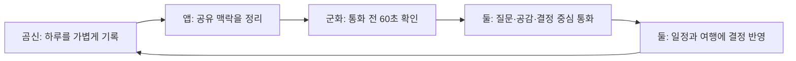

# 곰신로그 통합 PRD

- 문서 상태: 구현·디자인 기준 v4
- 기준일: 2026-08-08
- 제품 한 줄: 떨어져 지내는 군 커플이 서로의 하루와 앞으로의 계획을 짧은 시간 안에 이해하고, 설명보다 대화에 시간을 쓰게 하는 공동 맥락 앱

시각 기준은 `docs/design-references/clean-couple-ui-reference.jpg`와 `DESIGN_V2.md`의 2026-08-08 개정 사항을 따른다. 참고 이미지의 브랜드·캐릭터·문구를 복제하지 않고, **젊은 모바일 사용자에게 맞는 정보 밀도·여백·타임라인 문법**만 참고한다.

## 1. 제품이 해결하는 문제

곰신은 비교적 휴대폰을 자주 볼 수 있어 하루의 사건과 마음을 쌓을 수 있지만, 군화는 휴대폰 사용 시간이 짧고 일정하지 않다. 통화가 연결되면 곰신은 하루 전체를 다시 설명하고 군화는 무엇부터 물어볼지 찾느라 귀한 시간을 쓴다. 서로의 일정과 여행 계획도 메시지 여러 곳에 흩어져 같은 결정을 반복한다.

곰신로그는 이 비대칭을 다음 흐름으로 해결한다.

## 2. 핵심 사용자와 해야 할 일

### 곰신

- 하루의 사건·사진·목소리·감정을 부담 없이 남긴다.
- 통화에서 꼭 다룰 내용과 혼자만 볼 내용을 구분한다.
- 상대가 이미 맥락을 알고 전화하도록 돕는다.
- 면회·휴가·데이트·여행 준비를 한곳에서 정리한다.

### 군화

- 짧은 휴대폰 사용 시간에 상대의 최근 하루를 파악한다.
- 먼저 물을 질문과 조심스럽게 반응할 지점을 찾는다.
- 본인의 복무·휴가 일정과 둘의 할 일을 빠르게 공유한다.
- 계획에서 자신이 결정하거나 준비할 일만 바로 확인한다.

### 둘이 함께

- “무슨 일이 있었는지”를 반복 설명하는 시간을 줄인다.
- 서로의 감정과 의도를 오해하지 않는다.
- 약속·여행 준비·추억을 서로 다른 앱에 흩뜨리지 않는다.

## 3. 제품 구조

| 축 | 사용자 가치 | 대표 기능 |
| --- | --- | --- |
| 기록 | 비동기로 하루 맥락을 축적 | 글·사진·영상·음성, 감정 확인, 공개 범위, 통화 주제 표시 |
| 통화 준비 | 군화가 60초 안에 따라잡기 | 최근 핵심 3건, 먼저 살필 마음, 첫 질문, 원문 이동, 확인 완료 |
| 함께 계획 | 통화에서 정한 일을 실행 | 공유 일정, 공동 할 일, 여행 장소·시간·순서·메모·체크리스트 |
| 우리 관계 | 현재 관계와 기다림을 한눈에 확인 | 기념일, 전역 D-Day, 복무 진행률, 휴가·면회 |
| 신뢰와 통제 | 민감한 기록을 안전하게 관리 | 나만 보기, RLS, 내보내기, 연결 해제, 기록·계정 삭제 |

하단 탐색은 `홈 · 기록 · 일정 · 우리 · 마이` 다섯 개다. 여행은 일정의 계획 영역이며 일정 화면에서 바로 전환한다.

## 4. 사용자별 첫 화면 원칙

### 곰신 홈: 기록 우선

1. 글·사진·영상·음성·반응 중 기록 방식을 고르는 컴팩트한 시작 영역
2. 오늘 둘이 남긴 실제 기록과 관계 맥락
3. 축소형 전역 D-Day와 가까운 일정

긴 입력 폼과 AI 요약 카드를 홈에 펼쳐 놓지 않는다. 첫 화면은 “무엇을 남길지”를 빠르게 고르고, 실제 작성은 선택 뒤 이어지는 흐름에서 완성한다.

### 군화 홈: 따라잡기 우선

1. 삭제할 수 없는 `통화 전 60초`
2. 상대방의 오늘 타임라인
3. 축소형 전역 D-Day

마음 흐름·오늘의 요약·다정한 한마디·오늘의 기록은 기본 홈에서 내리고 브리핑의 `더 보기`, 기록 탭, 위젯 추가에서 접근한다. 다가오는 일정도 기본값에는 넣지 않고, `통화 때 꼭 얘기`가 표시된 긴급 일정·여행 결정만 브리핑의 최대 3개 안에서 경쟁시킨다.

위젯은 추가·제거·순서 변경이 가능하지만, 군화의 통화 준비 영역은 핵심 가치 보호를 위해 고정한다. 브리핑 하나가 첫 화면을 독점하지 않고, 확인 버튼과 상대방의 실제 기록 일부가 같은 첫 화면에서 보여야 한다.

## 5. 핵심 사용 시나리오

### 평일 통화

곰신이 틈틈이 기록하고 필요한 항목에 `통화 때 꼭 얘기`를 표시한다. 군화는 통화 직전 최대 3개의 새 맥락, 마음을 살필 지점, 첫 질문을 본다. 원문이 궁금하면 해당 기록으로 이동한다. 통화 후 확인 완료를 눌러 다음에는 새 기록부터 본다.

### 공동 일정

둘 중 한 명이 날짜·시간·종류·공개 범위와 `통화 때 꼭 얘기` 여부를 정해 일정을 만든다. 같은 날짜에 필요한 공동 할 일을 담당자와 마감 시각으로 등록하고 완료한다.

### 여행 계획

여행 기간을 만들고 날짜별 장소를 추가한다. 장소명·주소·영업시간·링크·방문 시간을 입력하며, 방문 시간이 있으면 자동 정렬하고 없으면 직접 순서를 바꾼다. 네이버지도 캡처는 기기 안에서 문자만 읽어 초안을 만들고 사용자가 확인한다. 둘이 공유 메모와 체크리스트로 결정을 마친다.

## 6. 기능 우선순위와 현재 상태

### 구현됨 — 현재 제품

- Google 로그인, 역할·복무 상태·닉네임 설정, 커플 공간 생성·6자리 코드 연결
- 역할별 홈과 편집 가능한 위젯
- 멀티미디어 기록, 감정 확인·수정, 공개/비공개, 오프라인 발송함
- 기록 달력·미디어 필터·작성자 구분·상세·수정·삭제
- 군화 전용 통화 브리핑과 `통화 때 꼭 얘기`, 원문 이동, 기기별 확인점
- 공유/개인 일정과 공동 할 일
- 여행 목록·상세·장소 시간표·캡처 OCR·메모·체크리스트·추억 연결
- 기념일·복무 진행률·전역 D-Day·다음 휴가/면회
- 테마, 프로필, 데이터 내보내기, 연결 해제, 기록·계정 삭제, 약관·개인정보

### 다음 검증 우선순위

1. 실제 곰신·군화 2계정으로 기록→브리핑→통화 완료 흐름 측정
2. 중요한 일정/여행 항목을 통화 브리핑에 선택적으로 포함하는 규칙 검증
3. 통화 후 `결정된 일`을 일정·할 일로 한 번에 옮기는 기능 탐색
4. 여러 기기 사이의 통화 확인점 동기화 필요성 검증
5. 접근성·저속 네트워크·오프라인 복구 실사용 검증

### 의도적으로 하지 않음

- 앱 안 채팅·음성/영상 통화
- 실시간 위치 추적과 군 부대 위치 수집
- 사용자가 확인하지 않은 AI 감정 진단·관계 점수
- 비공개 기록의 추천·요약·분석
- 유료 지도 API에 의존하는 핵심 흐름
- 불안과 경쟁을 만드는 연속 출석·커플 랭킹·과한 게임화

## 7. 디자인 원칙

1. **역할에 맞는 첫 행동:** 곰신은 남기기, 군화는 따라잡기가 첫 화면의 가장 큰 행동이다.
2. **실제 기록 우선:** 사진·음성·시간·작성자·사용자 원문을 AI식 제목·요약·추천 문구보다 먼저 보여준다.
3. **60초 규칙:** 군화의 핵심 화면에는 우선순위 3개를 넘기지 않는다.
4. **젊고 정돈된 밀도:** 접근성을 이유로 모든 글자·버튼·카드를 크게 만들지 않는다. 본문은 읽기 쉽게 유지하되 시간·썸네일·원문·상태가 한 화면에서 자연스럽게 스캔되어야 한다.
5. **카드 절제:** 하나의 의미가 묶일 때만 카드를 쓰고, 기록·일정·여행 장소는 기본적으로 리스트나 타임라인으로 표현한다. 카드 안에 카드를 넣지 않는다.
6. **따뜻하지만 차분하게:** 거의 흰색인 따뜻한 배경, 딥 네이비 본문, 코랄 핵심 행동을 기본으로 한다. 블루는 계획, 민트는 완료, 옐로는 확인 필요에만 제한한다.
7. **색만으로 말하지 않기:** 색·위치·아이콘·텍스트를 함께 써서 작성자와 상태를 구분한다.
8. **입력보다 선택:** 짧은 사용 시간에는 긴 양식보다 빠른 선택·기본값·이어쓰기를 제공한다.
9. **아기자기함은 절제로:** 부드러운 모서리·작은 틴트·얇은 선·여백으로 친밀함을 만들고 하트·이모지·그라데이션·파스텔 카드를 반복하지 않는다.
10. **불안을 자극하지 않기:** 읽음 압박, 점수화, 접속 감시는 만들지 않는다.
11. **실패를 숨기지 않기:** 저장 중·지연·오프라인·재시도를 분명하게 보여준다.

### 시각 수용 기준

- 390×844 첫 화면에서 곰신은 기록 시작 행동과 실제 기록 맥락을, 군화는 브리핑 확인 행동과 상대방 기록 일부를 함께 본다.
- 기록 타임라인은 날짜 제목 아래 `시간 → 미디어 → 원문·작성자·상태`가 한 흐름으로 읽히며, 개별 기록마다 큰 카드나 AI식 제목을 만들지 않는다.
- 한 화면의 큰 카드가 3개를 넘지 않고, 주요 CTA는 1개만 선명한 코랄로 표시한다.
- 시각적 버튼이 작아도 실제 터치 영역은 44px 이상이며, 본문 14px 이상·핵심 본문 15~16px·대비 4.5:1을 지킨다.
- 320×568, 긴 한국어, 라이트·다크 모드에서 잘림·겹침·가로 스크롤이 없다.

## 8. 성공 지표

북극성 지표는 **“통화에서 상황 설명이 줄고 공감·질문·결정에 더 많은 시간을 썼다고 두 사람이 느끼는가”**다.

- 통화 브리핑 진입→확인 완료 시간 중앙값 60초 이하
- 브리핑 원문 이동 및 `통화 때 꼭 얘기` 사용률
- 주간 기록→브리핑→확인 완료의 연결 비율
- 공동 일정/여행에서 두 사람 모두 한 번 이상 행동한 계획의 비율
- 2주 사용자 질문: 설명 시간 감소, 이해받는 느낌, 계획 반복 감소
- 저장 실패·동기화 오류·잘못된 권한 노출 0건을 품질 목표로 관리

체류 시간과 기록 개수 자체는 성공 지표로 삼지 않는다.

## 9. 출시 승인 기준

- 두 실제 계정으로 초대·연결·해제·재연결을 검증한다.
- 비공개 기록이 상대의 홈·검색·브리핑·분석에 나타나지 않는다.
- 마이그레이션과 배포 환경변수가 운영 환경에 적용되어 있다.
- 모바일 320px 이상, 키보드, 스크린리더 이름, 밝은/어두운 테마를 검증한다.
- 대표 5개 화면(곰신 홈·군화 홈·기록·일정·여행)이 디자인 참고 이미지의 밀도 원칙과 시각 수용 기준을 통과한다.
- 오프라인 작성, 업로드 실패, 재시도, 계정 삭제 복구 경로가 동작한다.
- 자동 테스트와 배포 CI가 모두 통과한다.
