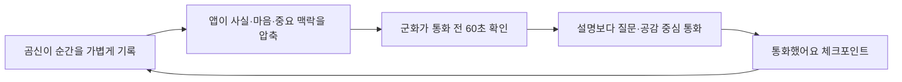

# 곰신로그 PRD — 설명은 짧게, 대화는 깊게

- 상태: 핵심 가치 재정의 v2
- 작성일: 2026-08-07
- 핵심 사용자: 상대적으로 기록할 시간이 있는 곰신, 휴대전화 사용 시간이 제한된 군화

## 1. 우리가 만드는 가치

곰신로그의 목적은 기록을 많이 쌓거나 커플 기능을 많이 제공하는 것이 아니다.

> **곰신이 비동기로 남긴 하루의 맥락을 군화가 통화 전 60초 안에 따라잡게 하여, 제한된 통화 시간을 상황 설명보다 공감·질문·애정 표현에 더 많이 쓰게 한다.**

사용자가 얻어야 하는 결과는 “앱을 오래 사용했다”가 아니라 다음과 같다.

- 곰신: “처음부터 다시 설명하지 않아도 내 하루를 알고 전화해 줬다.”
- 군화: “짧게 확인했지만 무엇을 물어보고 어떻게 반응해야 할지 알았다.”
- 두 사람: “통화 시간이 짧아도 서로에게 집중했다.”

## 2. 핵심 문제

### 곰신의 문제

- 하루 동안 있었던 일을 통화 한 번에 다시 순서대로 설명해야 한다.
- 중요한 일과 사소한 일을 상대가 구분하기 어렵다.
- 설명만 하다 통화가 끝나면 정작 감정과 관계 이야기는 남는다.

### 군화의 문제

- 휴대전화가 생겼을 때 확인해야 할 메시지와 정보가 많다.
- 곰신의 하루를 처음부터 읽기에는 시간이 부족하다.
- 앞뒤 맥락 없이 전화를 걸면 무엇부터 물어봐야 할지 어렵다.
- 중요한 일을 놓치거나 이미 설명한 것을 다시 물으면 서운함이 생길 수 있다.

## 3. 제품의 핵심 순환

이 순환을 `기록 → 압축 → 따라잡기 → 대화 → 체크포인트`라고 정의한다.

## 4. 제품 원칙

1. **통화가 주인공:** 앱은 전화와 대화를 대체하지 않고 준비한다.
2. **60초 안에:** 군화의 핵심 화면은 긴 피드가 아니라 최대 3개의 근거 있는 맥락이다.
3. **원문에 근거:** 요약은 곰신이 실제로 공유한 기록에서만 만들고 원문으로 이동할 수 있어야 한다.
4. **사람의 의도가 우선:** 장기적으로 곰신이 `통화 때 꼭 얘기하고 싶어`를 직접 표시할 수 있어야 한다.
5. **새로운 것만:** 마지막 통화 체크포인트 이후의 맥락을 우선한다.
6. **해석보다 확인:** 앱은 감정을 진단하지 않고 “먼저 물어봐 주세요”처럼 확인을 돕는다.
7. **무료·비공개 우선:** 외부 생성형 AI 없이도 작동하고 비공개 기록은 어떤 브리핑에도 들어가지 않는다.
8. **기능 수보다 대화 품질:** 일정·여행은 통화 맥락을 돕는 보조 기능이며 제품의 중심이 아니다.

## 5. 주요 사용 상황

### 상황 A — 평일 저녁의 짧은 통화

1. 곰신이 낮 동안 사진·음성·한 줄과 마음을 남긴다.
2. 군화가 휴대전화를 받은 뒤 홈의 `통화 전 60초`를 연다.
3. 새 소식 3개 이하, 먼저 알아둘 마음, 첫마디를 확인한다.
4. 원문이 궁금하면 해당 순간으로 바로 이동한다.
5. 통화 후 `통화했어요 · 여기까지 확인`을 누른다.

### 상황 B — 며칠 만의 통화

- 앱은 오늘만 보여주지 않고 최근 7일 중 마지막 체크포인트 이후의 기록을 압축한다.
- 어려웠던 일, 특별한 일, 서로를 떠올린 기록, 질문이 있는 기록을 우선한다.
- 오래된 세부 정보 전체를 읽게 하지 않고 필요할 때만 원문을 연다.

### 상황 C — 다음 통화를 위한 곰신의 기록

- 작성 화면은 `무슨 일이 있었는지 · 어떤 마음이었는지 · 통화 때 듣고 싶은 말`을 안내한다.
- 캡처·사진·음성도 맥락의 근거가 된다.
- 비공개로 선택한 내용은 군화의 브리핑에 절대 포함되지 않는다.

## 6. 기능 우선순위

### P0 — 핵심 가치 검증

- 곰신의 빠른 기록: 글·사진·영상·음성·반응·확정한 감정
- 군화 홈 상단 고정 `통화 전 60초`
- 최근 7일 또는 마지막 통화 이후 새 기록 필터
- 최대 3개의 핵심 맥락과 원문 이동
- 먼저 알아둘 마음과 근거 기반 첫마디
- 기기별 `통화했어요` 체크포인트
- 개인 기록 완전 제외
- 일정·할 일과 여행은 기존 기능으로 유지

### P1 — 실제 사용자 검증 후

- 곰신의 `통화 때 꼭 얘기하고 싶어` 명시적 표시
- `답을 원하는 질문 / 그냥 들어줬으면 함 / 조언이 필요함` 의도 선택
- 두 사람에게 동기화되는 마지막 통화 체크포인트
- 예정된 연락 가능 시간에 맞춘 `통화 준비됨` 안내
- 통화 후 `오늘 대화에서 남기고 싶은 한마디` 공동 기억

### P2 — 충분한 수요가 확인된 뒤

- 개인정보를 보내지 않는 온디바이스 또는 선택형 AI 압축
- 반복되는 미해결 주제의 사용자 확인형 목록
- OS 알림과 위젯
- 공유 캘린더 내보내기와 선택형 지도 자동완성

## 7. 만들지 않을 것

- 앱 안의 채팅이나 전화 기능
- 실시간 위치 추적
- 상대의 감정을 점수나 퍼센트로 추정하는 기능
- 비공개 기록을 이용한 추천·분석
- 사용자가 확인할 수 없는 AI 해석
- 관계 만족도를 높인다고 단정하는 게임·연속 접속 보상
- 핵심 통화 준비를 가리는 복잡한 대시보드

## 8. 성공 지표

### 북극성 지표

**맥락 설명에 쓰는 통화 시간이 줄고, 의미 있는 질문·공감에 쓴 시간이 늘었는가?**

### 측정 방법

- 통화 전 브리핑 완료율
- 브리핑 첫 진입부터 확인 완료까지 걸린 시간: 목표 60초 이하
- 원문 이동률: 너무 높으면 압축 부족, 너무 낮으면서 만족도가 낮으면 신뢰 부족
- `통화했어요` 체크포인트 사용률
- 주 1회 초간단 질문:
  - “오늘 통화에서 상황 설명에 시간을 많이 썼나요?”
  - “상대가 내 맥락을 알고 있다고 느꼈나요?”
- 두 계정 2주 테스트에서 “이미 말했잖아” 또는 “처음부터 설명해야 했다” 사례 감소

앱 체류시간과 기록 개수는 보조 지표일 뿐 성공 지표로 사용하지 않는다.

## 9. 출시 승인 조건

- 군화가 설명 없이 60초 안에 새 맥락과 첫 질문을 찾는다.
- 비공개 기록이 카운트·마음·첫마디·원문 링크 어디에도 드러나지 않는다.
- 체크포인트 이후 새 기록만 나타나고 최근 7일을 다시 볼 수 있다.
- 저장 실패가 성공으로 보이지 않는다.
- 긴 기록이 390px 화면에서 깨지지 않고 최대 3개로 제한된다.
- 곰신의 기록 경험이 기존보다 복잡해지지 않는다.
- 일정·여행·감정·기존 기록 기능의 회귀 테스트가 통과한다.

## 10. 한 문장 포지셔닝

**Between이 둘만의 공간이고 Paired가 대화 질문을 제공한다면, 곰신로그는 제한된 통화 직전에 실제 하루의 맥락을 60초로 압축해 주는 군 커플 전용 대화 준비 도구다.**

