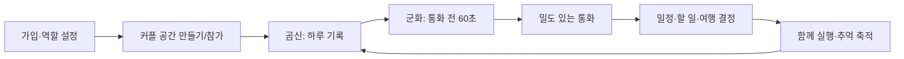
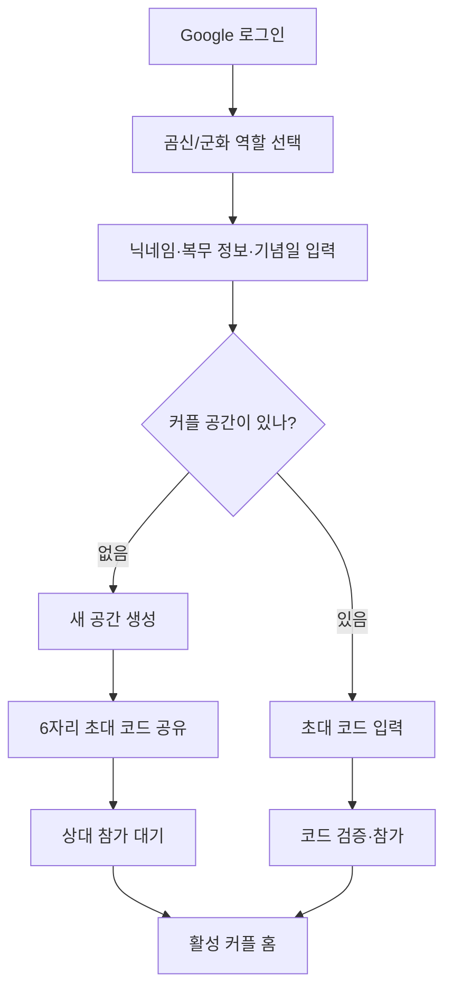
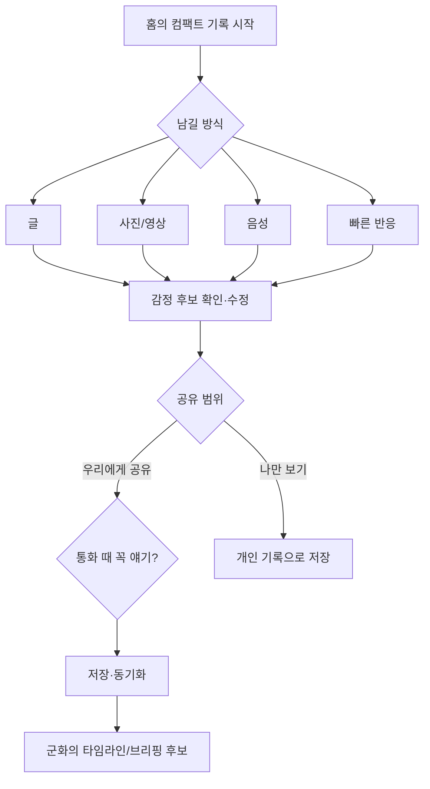
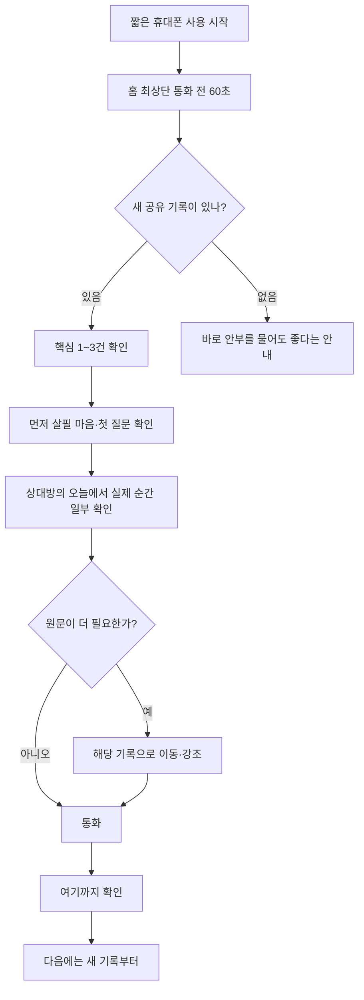
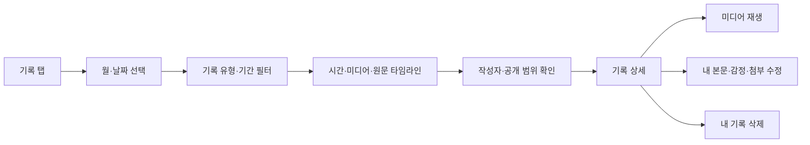
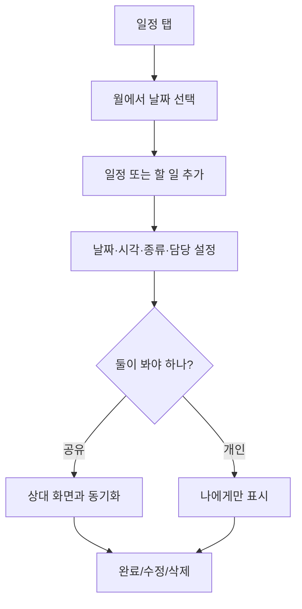
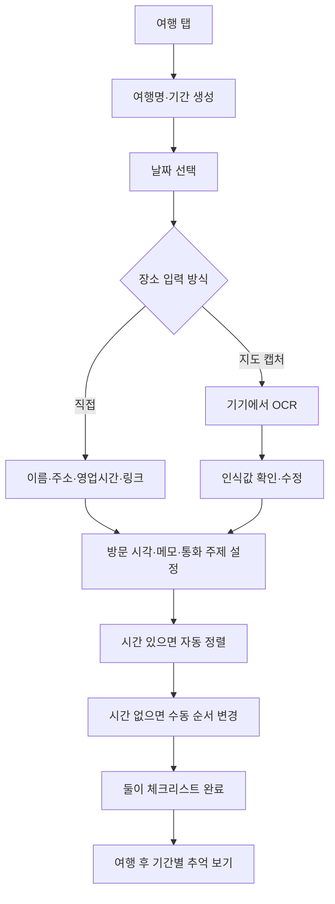
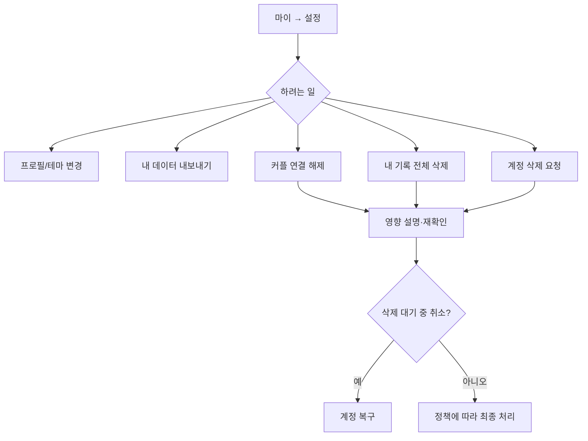

> **Status: HISTORICAL SUPPORTING.** Product direction is owned by
> [`PRODUCT_V3.md`](PRODUCT_V3.md); use this file only for detailed flow reference.

# 곰신로그 전체 유저 플로우

> 최상위 가치·MVP·IA·핵심 루프는 `PRODUCT_PRD.md` v5가 기준이다. 이 문서는
> 오류·복구·권한을 포함한 상세 분기 명세로 사용한다.

화면 전환과 정보 노출은 `docs/design-references/clean-couple-ui-reference.jpg`의 컴팩트한 리스트·타임라인 밀도를 따른다. 사용 단계 수를 줄이기 위해 모든 입력을 한 화면에 펼치지 않고, **선택 → 필요한 입력 → 확인** 순서로 점진적으로 보여준다.

## 1. 서비스 전체 흐름

## 2. 첫 가입과 커플 연결

잘못되거나 만료된 코드는 이유와 재입력 방법을 보여준다. 연결 대기 중에는 상대 데이터가 있는 것처럼 보이지 않으며 설정에서 코드를 재발급할 수 있다.

## 3. 곰신의 하루 기록

홈에서는 기록 유형 네 가지와 이어쓰기만 먼저 보인다. 감정·공개 범위·통화 표시는 유형을 고른 뒤 필요한 시점에 나타나며, 사용자가 저장하기 전에 한 번에 확인한다. 오프라인이면 작성 내용을 발송함에 안전하게 보관한다. 실패한 첨부는 지우지 않고 재시도하며, 화면 이동 뒤에도 작성 초안을 이어 쓴다.

## 4. 군화의 통화 준비

브리핑은 화면 전체를 독점하지 않는다. 확인 행동과 실제 기록 일부가 390×844 첫 화면에서 함께 보여 “앱의 설명 → 상대의 원문” 순서가 한눈에 이어져야 한다.

## 5. 기록을 다시 보고 관리

목록에서는 개별 기록을 큰 카드로 반복하지 않고 시간, 썸네일, 사용자 원문 2~3줄을 먼저 스캔한다. 상대 기록은 볼 수만 있고 수정·삭제할 수 없다. 비공개 기록은 작성자에게만 나타난다.

## 6. 공동 일정과 할 일

오프라인에서는 마지막 계획을 읽을 수 있지만 충돌을 피하기 위해 변경은 잠시 막고 연결 후 재시도를 안내한다.

## 7. 여행 만들기와 동선 정하기

OCR 결과는 초안일 뿐이다. 저장 전 사용자가 상호명·주소·영업시간을 확인한다. 캡처는 서버에 올라가지 않는다.

## 8. 우리와 복무 확인

- `우리`에서 함께한 기간과 월별 기념일, 다가오는 여행을 본다.
- `복무 현황`에서 전역 D-Day, 진행률, 군종·복무 기간과 다음 휴가/면회를 본다.
- 정보가 잘못되면 수정 권한이 있는 사용자가 변경하고 둘의 관련 화면에 반영한다.

## 9. 설정·연결 해제·삭제

파괴적 행동은 한 번의 실수로 실행되지 않는다. 연결 해제 뒤 상대의 데이터는 즉시 화면에서 제거한다.

## 10. 예외 흐름

| 상황 | 제품 행동 |
| --- | --- |
| 인증 동기화 지연 | 로그아웃이나 신규 가입으로 단정하지 않고 확인 중 표시 |
| 커플 연결 전 | 개인 기능과 연결 방법을 보여주고 상대 데이터는 숨김 |
| 인터넷 끊김 | 기록은 대기열 저장, 계획은 읽기 전용, 마지막 동기화 표시 |
| 저장 실패 | 입력 유지, 중복 방지, 재시도 |
| 권한 없음 | 상대 데이터의 존재를 노출하지 않고 안전한 화면으로 이동 |
| 다른 계정 로그인 | 초안·확인점을 사용자/커플 단위로 분리 |
| 삭제 대기 계정 | 일반 앱보다 복구 또는 삭제 상태 안내 우선 |

## 11. 대표 2주 사용 검증

1. 곰신과 군화 실제 두 계정을 연결한다.
2. 평일 5회 이상 곰신이 공유/비공개/통화 주제 기록을 섞어 남긴다.
3. 군화가 통화 전 브리핑을 보고 원문 이동과 확인 완료를 사용한다.
4. 둘이 일정 2개, 공동 할 일 3개, 여행 1개를 함께 편집한다.
5. 마지막에 “설명 시간이 줄었나, 이해받았나, 계획을 덜 반복했나”를 각자 답한다.

디자인 검증에서는 추가로 다음을 관찰한다.

6. 곰신이 홈에서 30초 안에 원하는 기록 방식을 골라 작성 흐름을 시작하는가?
7. 군화가 스크롤 위치를 잃지 않고 브리핑과 상대의 실제 기록을 구분하는가?
8. 기록 탭에서 사진·음성·사용자 원문이 앱의 배지나 요약보다 먼저 눈에 들어오는가?
9. 사용자들이 화면을 “너무 크고 둔하다”, “AI 템플릿 같다”, “업무 앱 같다”고 느끼지 않는가?
