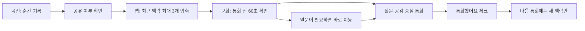
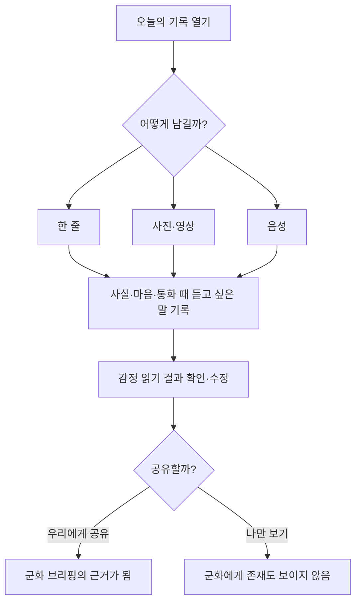
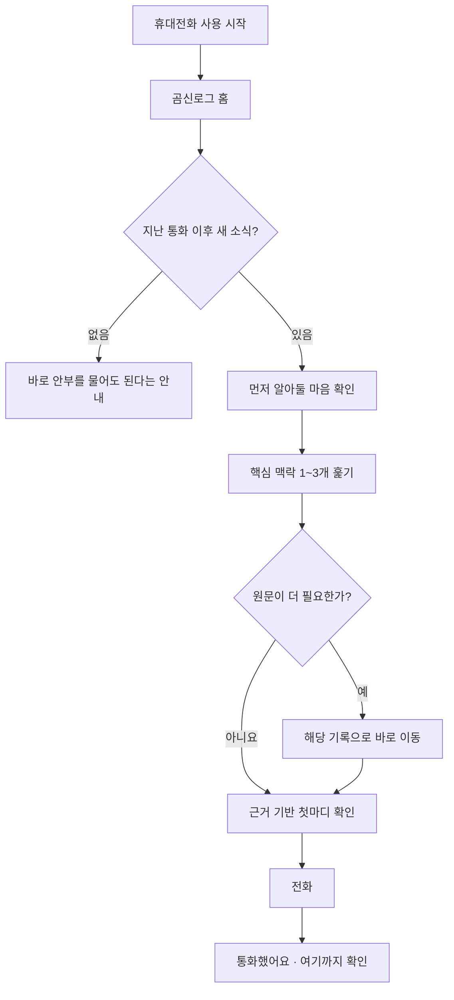
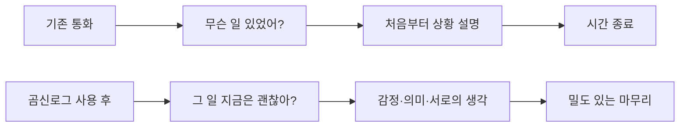
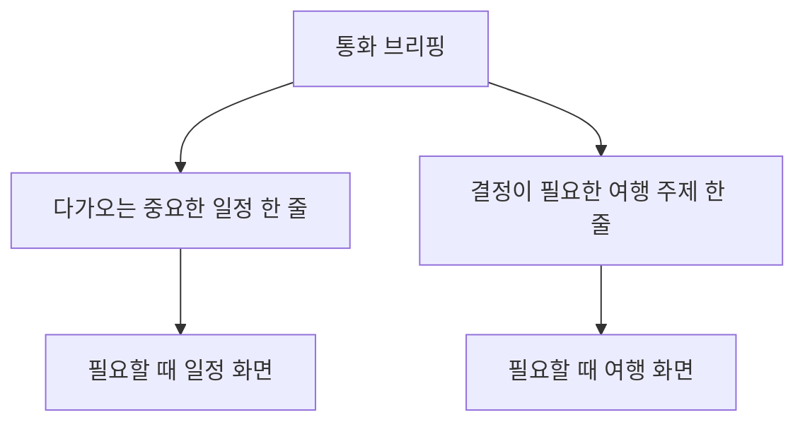

# 사용자 흐름 — 기록에서 깊은 통화까지

## 1. 핵심 서비스 흐름

## 2. 곰신의 기록 흐름

작성 목표는 완벽한 일기가 아니라 나중에 같은 설명을 반복하지 않아도 되는 작은 맥락을 남기는 것이다.

## 3. 군화의 통화 전 흐름

## 4. 통화의 목표 상태

앱은 오른쪽 흐름을 보장한다고 주장하지 않는다. 다만 오른쪽 흐름이 시작될 가능성을 높이는 맥락과 질문을 제공한다.

## 5. 며칠 만의 통화

1. 체크포인트가 없으면 최근 7일의 공유 기록을 읽는다.
2. 비공개와 7일 이전 기록을 제외한다.
3. 힘든 일·서로를 떠올린 순간·특별한 일·질문을 우선한다.
4. 최대 3개로 줄인 뒤 시간순으로 보여준다.
5. 더 궁금한 항목만 원문으로 이동한다.
6. 통화 뒤 체크포인트를 갱신한다.

## 6. 예외 흐름

| 상황 | 동작 |
| --- | --- |
| 동기화 확인 중 | `새 소식 없음`으로 단정하지 않고 확인 중 표시 |
| 오프라인 | 캐시된 맥락을 보여주되 최신이 아닐 수 있음을 안내 |
| 기록 본문 없음 | 사진·영상·음성을 남겼다는 사실만 표시 |
| 체크포인트 저장 실패 | 이전 체크포인트와 목록 유지 |
| 커플 연결 해제 | 이전 상대의 브리핑 즉시 제거 |
| 계정 변경 | 사용자·커플별 키로 체크포인트 분리 |

## 7. 2주 파일럿 흐름

### 매일

- 곰신: 중요한 순간이 있을 때 1~3회 기록
- 군화: 통화 직전 브리핑 확인
- 통화 후: 체크포인트 선택

### 주 2회 질문

- 곰신: “오늘 처음부터 다시 설명해야 했나요?”
- 군화: “통화 전에 무엇을 물어볼지 알았나요?”
- 두 사람: “통화가 상황 전달보다 서로의 생각을 나누는 시간이었나요?”

### 성공 신호

- 브리핑을 보지 않은 날보다 본 날에 설명 부담이 낮다.
- 기록량을 늘리지 않아도 곰신의 `알고 전화했다`는 느낌이 높다.
- 군화가 60초 안에 준비를 끝낸다.

## 8. 일정과 여행의 연결

일정과 여행은 홈을 차지하는 피드가 아니라, 통화에서 실제 결정이 필요할 때 들어가는 보조 공간으로 둔다.

