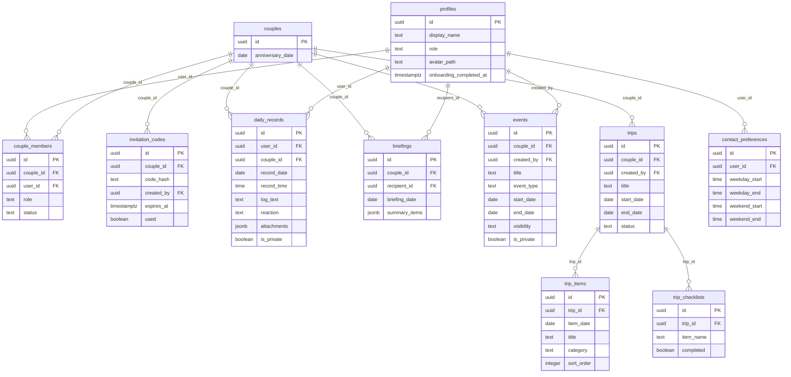

# 곰신로그 전체 서비스 청사진

> **"답장이 늦어도, 오늘의 순간은 놓치지 않도록."**

---

## 1. 현재 상태 진단

### 1-1. 프로젝트 기본 정보

| 항목 | 값 |
|---|---|
| 프로젝트 경로 | `C:\Users\king0\.gemini\antigravity\scratch\gomsin-log` |
| 서비스명 | 곰신로그 (GomsinLog) |
| package name | `gomsinlog` |
| 프레임워크 | React 19 + TypeScript + Vite 6 + Tailwind CSS v4 |
| 라우팅 | React Router v7 |
| 상태 관리 | Context + useState, localStorage hydration |
| 백엔드 | Supabase (미연결, 스키마만 존재) |
| localStorage key | `gomsinlog.state.v1` |

### 1-2. 영역별 상태 매트릭스

| 영역 | 현재 상태 | 실제 근거 파일 | 문제 | 권장 조치 | 우선순위 |
|---|---|---|---|---|---|
| **NABBVN 흔적** | 일부 존재 | [SUPABASE_SETUP.md](file:///C:/Users/king0/.gemini/antigravity/scratch/gomsin-log/docs/SUPABASE_SETUP.md) L5, `_original/nabbvn1-main/` 디렉토리 | 문서 내 `nabbvn` 경로 참조, 원본 디렉토리 잔존 | 경로 수정 + `_original/` 삭제 또는 `.gitignore` 등록 | **P0** |
| **Apple 로그인** | UI만 존재 | [OnboardingPage.tsx](file:///C:/Users/king0/.gemini/antigravity/scratch/gomsin-log/src/pages/OnboardingPage.tsx) L195-201, [supabase.ts](file:///C:/Users/king0/.gemini/antigravity/scratch/gomsin-log/src/lib/supabase.ts) `signInWithApple` | iOS 조건부 버튼만 렌더링. 실제 OAuth 미연결. 클릭 시 toast 후 온보딩으로 전진(가짜 성공은 아님) | Supabase Apple Provider 설정 후 실제 연동 | **P1** |
| **Google 로그인** | UI만 존재 | [OnboardingPage.tsx](file:///C:/Users/king0/.gemini/antigravity/scratch/gomsin-log/src/pages/OnboardingPage.tsx) L204-209, [supabase.ts](file:///C:/Users/king0/.gemini/antigravity/scratch/gomsin-log/src/lib/supabase.ts) `signInWithGoogle` | 버튼만 존재. 실제 OAuth 미연결 | Supabase Google Provider 설정 후 실제 연동 | **P1** |
| **이메일/Magic Link** | UI 존재, 제거 대상 | [OnboardingPage.tsx](file:///C:/Users/king0/.gemini/antigravity/scratch/gomsin-log/src/pages/OnboardingPage.tsx) L27-30, L69-84, L211-217 | 사용자 요구사항에 의해 이메일 로그인은 제거 대상 | Magic Link 관련 UI, 상태, 타입, repository 메서드 모두 제거 | **P0** |
| **인증 콜백** | 미구현 | — | Supabase Auth callback handler 없음. redirect 복귀 로직 없음 | Auth callback route + session restore 구현 필요 | **P1** |
| **온보딩** | 일부 구현 | [OnboardingPage.tsx](file:///C:/Users/king0/.gemini/antigravity/scratch/gomsin-log/src/pages/OnboardingPage.tsx) 674줄 | 7단계 UI 존재. 그러나 `handleAuthNotice`가 toast 후 `setStep(1)`로 진행하여 인증 없이 온보딩 통과 가능. 데모 버튼은 온보딩을 완전 스킵하고 바로 홈 진입 | 인증 성공 후에만 온보딩 진입하도록 게이트 추가. 데모 모드도 간소화된 온보딩 경험 제공 | **P1** |
| **커플 연결** | UI만 존재 | [OnboardingPage.tsx](file:///C:/Users/king0/.gemini/antigravity/scratch/gomsin-log/src/pages/OnboardingPage.tsx) Step 3, [001_initial_schema.sql](file:///C:/Users/king0/.gemini/antigravity/scratch/gomsin-log/supabase/migrations/001_initial_schema.sql) | UI에서 "새 공간 만들기/초대 코드 입력" 선택만 존재. 실제 코드 생성·검증·연결 로직 없음. DB에는 `invitation_codes` + RPC 설계 완료 | Supabase 연동 시 RPC 호출 구현 | **P1** |
| **기록 작성** | 구현됨 | [GomshinHome.tsx](file:///C:/Users/king0/.gemini/antigravity/scratch/gomsin-log/src/features/home/GomshinHome.tsx) | localStorage 기반 기록 저장 동작. 사진/영상/음성은 데모 시뮬레이션(Unsplash URL 또는 파일명만). 실제 미디어 업로드 없음 | Storage SDK 연동 | **P2** |
| **오늘의 로그** | 구현됨 | [SoldierHome.tsx](file:///C:/Users/king0/.gemini/antigravity/scratch/gomsin-log/src/features/home/SoldierHome.tsx) | 군화 홈에서 상대의 오늘 공유 기록을 시간순 타임라인으로 표시. private 필터링 적용 | DB 연동 후 Realtime 구독 필요 | **P2** |
| **빠른 정리** | 구현됨 | [briefing.ts](file:///C:/Users/king0/.gemini/antigravity/scratch/gomsin-log/src/lib/briefing.ts), [SoldierHome.tsx](file:///C:/Users/king0/.gemini/antigravity/scratch/gomsin-log/src/features/home/SoldierHome.tsx) | 규칙 기반 요약 생성. 2개 미만 시 요약 안 함. recordIds 근거 추적. 클릭 시 원문 smooth scroll + 2초 highlight | 향후 AI 요약으로 고도화 가능. 현재 구현 유지 | **유지** |
| **기록 아카이브** | 구현됨 | [RecordPage.tsx](file:///C:/Users/king0/.gemini/antigravity/scratch/gomsin-log/src/pages/RecordPage.tsx) 568줄 | 7열 월간 달력, 미디어 필터, 날짜별 타임라인, 빠른 정리, 기록 상세 모달. private 필터링 적용 | 검색, 전후 날짜 이동 미구현 | **P3** |
| **복무 정보** | 구현됨 | [ServicePage.tsx](file:///C:/Users/king0/.gemini/antigravity/scratch/gomsin-log/src/pages/ServicePage.tsx) 228줄 | D-Day, 복무율, 군종별 자동 전역일 계산, 수동 수정, 연락 가능 시간 표시. 식단표는 하드코딩된 예시 데이터 | 식단표 제거 또는 "준비 중" 처리 | **P0** |
| **공유 일정** | 미구현 | — | 일정 생성/조회/수정/삭제 기능 없음 | 신규 구현 필요 | **P4** |
| **여행 플래너** | 미구현 | — | 여행 계획/체크리스트/아카이브 없음 | 신규 구현 필요 | **P5** |
| **설정/삭제** | 일부 구현 | [MyPage.tsx](file:///C:/Users/king0/.gemini/antigravity/scratch/gomsin-log/src/pages/MyPage.tsx) 332줄 | 프로필 카드, 데모 역할 전환, PWA 설치 안내, 연결 해제 모달, 계정 삭제 모달, 데이터 초기화. 실제 서버 삭제는 미구현 | Edge Function 연동 필요 | **P1** |
| **private 권한** | UI 격리만 | [GomshinHome.tsx](file:///C:/Users/king0/.gemini/antigravity/scratch/gomsin-log/src/features/home/GomshinHome.tsx), [SoldierHome.tsx](file:///C:/Users/king0/.gemini/antigravity/scratch/gomsin-log/src/features/home/SoldierHome.tsx), [RecordPage.tsx](file:///C:/Users/king0/.gemini/antigravity/scratch/gomsin-log/src/pages/RecordPage.tsx), [briefing.ts](file:///C:/Users/king0/.gemini/antigravity/scratch/gomsin-log/src/lib/briefing.ts) | 클라이언트 `!r.isPrivate` 필터 일관 적용. DB RLS도 설계 완료(`001_initial_schema.sql` L143-158). 그러나 실제 연동 없음 | Supabase 연동 시 RLS로 서버 강제 | **P1** |
| **PWA** | 구현됨 | [manifest.json](file:///C:/Users/king0/.gemini/antigravity/scratch/gomsin-log/public/manifest.json), [sw.js](file:///C:/Users/king0/.gemini/antigravity/scratch/gomsin-log/public/sw.js), [index.html](file:///C:/Users/king0/.gemini/antigravity/scratch/gomsin-log/index.html), [InstallPromptBanner.tsx](file:///C:/Users/king0/.gemini/antigravity/scratch/gomsin-log/src/components/InstallPromptBanner.tsx), [main.tsx](file:///C:/Users/king0/.gemini/antigravity/scratch/gomsin-log/src/main.tsx) | manifest, SW, iOS meta tags, standalone mode, safe-area 지원. 아이콘이 SVG만 있고 PNG 없음(iOS 호환 위험) | iOS용 180x180 PNG apple-touch-icon 추가 | **P0** |
| **테스트** | 미구현 | — | unit/integration/E2E 테스트 코드 0개 | Vitest + Playwright 도입 | **P2** |
| **수익화 기반** | 미구현 | — | 결제, 구독, 제휴 코드 없음 | Phase 6에서 설계 | **P6** |

### 1-3. Critical 문제 (즉시 수정 필요 항목)

> [!CAUTION]
> 아래 항목은 코드 변경 전이라도 인지하고 있어야 할 위험입니다.

1. **인증 없이 온보딩 통과 가능**: Google/Apple 버튼 클릭 시 toast만 표시하고 `setStep(1)`로 온보딩 진행. 실제 인증 없이 프로필이 생성됨.
2. **`AuthUser.provider`에 `'email'` | `'demo'` 타입 존재**: 요구사항에 따라 `'apple' | 'google'`만 허용해야 함.
3. **`_original/nabbvn1-main/` 디렉토리 잔존**: 빌드에는 포함되지 않지만 Git에 포함될 위험.
4. **`docs/SUPABASE_SETUP.md`에 `nabbvn` 경로 하드코딩**.
5. **ServicePage의 하드코딩 식단표**: 실제 데이터 소스 없이 가짜 정보를 사실처럼 표시.

### 1-4. NABBVN 제거 대상

| 파일 | 유형 | 내용 | 조치 |
|---|---|---|---|
| `_original/nabbvn1-main/` | 디렉토리 | 원본 프로젝트 전체 | **삭제** 또는 `.gitignore`에 추가 |
| `docs/SUPABASE_SETUP.md` L5 | 텍스트 | `file:///...scratch/nabbvn/docs/...` 경로 | 경로를 `gomsin-log`로 수정 |
| `docs/SUPABASE_DEPLOY_GUIDE.md` L1 | 텍스트 | `APP_NAME` 플레이스홀더 | `곰신로그`로 치환 |

> 코드, manifest, package.json, index.html, localStorage key에서는 NABBVN 흔적 **없음** 확인 완료.

---

## 2. 최종 제품 구조

### 2-1. 핵심 가치

곰신로그는 "군화와 곰신이 떨어져 있는 시간에도 서로의 하루를 남기고, 기다리고, 다시 이어 볼 수 있게 하는 1:1 비공개 커플 라이프 로그 서비스"다.

핵심 경험 흐름:

```
곰신이 하루의 순간을 부담 없이 남긴다
→ 군화가 휴대전화 사용 가능 시간에 접속한다
→ 짧은 시간 안에 곰신의 하루를 맥락으로 이해한다
→ 원문·사진·음성을 확인한다
→ 통화나 메시지에서 자연스럽게 대화를 이어간다
```

### 2-2. 역할 구조

| 역할 | 홈 화면 우선순위 | 복무 기능 | 기록 작성 |
|---|---|---|---|
| **곰신** | 기록 작성 CTA 최우선 | 상대 군화의 복무 정보 열람 | ✅ 가능 |
| **군화** | 상대의 오늘 타임라인 + 빠른 정리 | 본인 복무 정보 관리 | ✅ 가능 |

### 2-3. 과거 / 현재 / 미래 정보 구조

```
과거: 기록 아카이브, 추억 컬렉션, 여행 아카이브
현재: 오늘의 로그, 기록 작성, 빠른 정리
미래: 복무 D-Day, 휴가·면회·외박, 공유 일정, 여행 계획
```

### 2-4. 내비게이션 비교

| 기준 | A. 5탭 유지형 | B. 4탭 축소형 | C. 3탭 핵심형 |
|---|---|---|---|
| **곰신 기록 시작 속도** | 홈 탭에서 즉시 | 홈 탭에서 즉시 | 오늘 탭에서 즉시 |
| **군화 하루 확인 속도** | 홈 탭에서 즉시 | 홈 탭에서 즉시 | 오늘 탭에서 즉시 |
| **복무 정보 접근** | 전용 탭 1탭 | 우리 → 군화의 복무 (2탭) | 우리 → 복무 (2탭) |
| **휴가·면회·여행 확장성** | 복무 탭 과밀 위험 | 우리 탭 내 자연스러운 확장 | 우리 탭 내 모듈형 확장 |
| **기록 아카이브 접근** | 전용 탭 1탭 | 전용 탭 1탭 | 보관함 탭 1탭 |
| **설정 복잡도** | 전용 탭 (과할 수 있음) | 전용 탭 (적정) | 상단 메뉴 (깔끔) |
| **초보 사용자 인지 부담** | 5개 탭 = 선택지 과다 | 4개 탭 = 적정 | 3개 탭 = 최소 |
| **모바일 PWA 적합성** | 탭 아이콘 작아짐 | 양호 | 최적 |
| **탭 과밀 위험** | 높음 (일정·여행 추가 시) | 중간 | 낮음 |

### 2-5. 최종 구조 권고: **B. 4탭 축소형**

```
오늘  /  기록  /  우리  /  설정
```

**선택 근거:**

1. **오늘 탭**: 곰신과 군화의 핵심 행동(기록 남기기 / 하루 확인하기)을 1탭에서 모두 해결. 현재 홈 화면의 GomshinHome/SoldierHome 구조를 그대로 유지.
2. **기록 탭**: 기록 아카이브 전용. 월간 달력 + 날짜별 타임라인 + 미디어 필터. 현재 RecordPage 그대로 유지.
3. **우리 탭**: 관계·복무·일정·여행을 하나의 공간에 통합. 스택형 모듈로 필요한 기능만 열림.
   - 상단: 연결 정보, 사귄 날짜, D+N일
   - 군화의 복무: D-Day, 복무율, 연락 가능 시간
   - 다가오는 일정: 면회·휴가·기념일·여행
   - 추억: 과거 기록 하이라이트
4. **설정 탭**: 계정, 알림, PWA 설치, 데이터 관리, 연결 해제, 삭제. 현재 MyPage를 정리하여 이동.

**복무를 독립 탭에서 제거하는 이유:**
- 복무 정보는 군화가 하루에 1~2번 확인하는 정보이지 상시 탐색 대상이 아님
- 휴가·면회·외박을 추가하면 복무 탭이 과밀해짐
- "우리" 안에서 "관계 → 복무 → 일정 → 추억"이 자연스러운 정보 흐름

**마이(설정)를 유지하는 이유:**
- 3탭으로 줄이면 설정 진입이 상단 메뉴로 숨겨져 계정 삭제·연결 해제 같은 중요 기능의 발견 가능성이 낮아짐
- 4탭이 모바일에서 충분히 쾌적하고, 향후 기능이 늘어나도 "우리" 내부 스택으로 흡수 가능

### 2-6. 전체 사용자 여정

```
앱 실행
→ 세션 확인 (checking)
→ [미로그인] 시작 화면 (곰신로그 로고 + Apple/Google 로그인 + 데모)
→ [로그인 성공] 최초 사용자 여부 확인
→ [최초] 온보딩: 역할 → 닉네임 → 우리 공간 → 사귄 날짜 → 복무 → 연락 시간
→ [온보딩 완료 + 연결됨] 역할별 오늘 화면
→ [온보딩 완료 + 미연결] 초대 코드 대기 화면
→ [재방문] 세션 복원 → 역할별 오늘 화면
```

---

## 3. UI/UX 청사진

### 3-1. 시작 화면

```
[곰신로그 로고 + CoupleAvatar]
"답장이 늦어도, 오늘의 순간은 놓치지 않도록."
군화와 곰신, 둘만의 하루를 사진과 짧은 기록으로 남겨요.

[ Apple로 계속하기 ]     ← iOS에서만 노출
[ Google로 계속하기 ]
─────────────────────
[ 데모 공간 먼저 둘러보기 → ]

서비스 이용약관 및 개인정보 처리방침
```

> [!IMPORTANT]
> - 이메일 로그인 버튼 **제거**
> - OAuth 미설정 시: "로그인 연결을 준비 중이에요. 데모로 먼저 둘러볼 수 있어요."
> - 데모 버튼 클릭 시: 간소화된 역할·닉네임 선택 후 데모 데이터와 함께 홈 진입 (온보딩 완전 스킵 대신 최소 2단계 체험 제공)

### 3-2. 인증 상태 타입

```ts
type AuthStatus =
  | 'checking'        // 세션 확인 중 (splash)
  | 'unauthenticated' // 미로그인 (시작 화면)
  | 'authenticating'  // provider 이동 중
  | 'authenticated'   // 로그인 완료
  | 'error'           // 인증 오류

type AuthProvider = 'apple' | 'google'

type AuthUser = {
  id: string
  email?: string
  provider: AuthProvider
}
```

> 기존 `'email' | 'demo'` provider 타입 제거. 데모 모드는 `isDemoMode: true` 플래그로 관리.

### 3-3. 온보딩 (6단계)

| 단계 | 이름 | 곰신 | 군화 | 건너뛰기 |
|---|---|---|---|---|
| 1 | 역할 선택 | ✅ | ✅ | ✗ |
| 2 | 닉네임 | ✅ | ✅ | ✗ |
| 3 | 우리 공간 | ✅ | ✅ | ✗ |
| 4 | 사귄 날짜 | ✅ | ✅ | ✅ |
| 5 | 복무 정보 | 자동 스킵 | ✅ | ✅ |
| 6 | 연락 가능 시간 | 자동 스킵 | ✅ | ✅ |

> 현재 구현은 이 구조를 따르고 있음. 유지.

### 3-4. 곰신 중심 오늘 화면

현재 [GomshinHome.tsx](file:///C:/Users/king0/.gemini/antigravity/scratch/gomsin-log/src/features/home/GomshinHome.tsx)의 구조를 유지하되 개선:

```
안녕, {닉네임}아 ♡
{상대방}에게 전할 오늘 하루를 자유롭게 남겨보세요.

[ 지금 찍기 📷 ] [ 사진 올리기 🖼️ ] [ 한 줄 남기기 ✍️ ]

─── 오늘 내가 남긴 순간 ───
시간순 타임라인 (본인 기록)
```

### 3-5. 군화 중심 오늘 화면

현재 [SoldierHome.tsx](file:///C:/Users/king0/.gemini/antigravity/scratch/gomsin-log/src/features/home/SoldierHome.tsx)의 구조를 유지:

```
안녕, {닉네임}아 ♡
{상대방}이가 오늘 남긴 N개의 순간이 있어요.

[오늘의 로그 · 마지막 기록 18:30 · 사진2 음성1 글3]

─── 빠른 정리 (공유 2개 이상 시) ───
• 요약 문장 (클릭 → 원문 이동 → 2초 highlight)
💬 통화 첫마디 추천

─── 시간순 타임라인 ───
상대의 공유 기록 카드들
```

### 3-6. 우리 탭 (통합 설계)

```
{나} ♡ {상대방}

━━ 우리의 시간 ━━
연결 N일째 | 사귄 날짜 | 다음 기념일 D-N

━━ 군화의 복무 ━━ [스택 → ServicePage 내용]
D-Day | 복무율 | 연락 가능 시간

━━ 다가오는 일정 ━━ [스택 → 일정 목록]
면회 D-3 | 휴가 D-14 | ...

━━ 추억 ━━
다시 꺼내보고 싶은 순간 (캐러셀)
```

### 3-7. 빈 / 오류 / 로딩 상태 필수 설계

| 상태 | 화면 |
|---|---|
| 세션 확인 중 | 곰신로그 로고 + 로딩 스피너 |
| 인증 오류 | "로그인에 실패했어요. 다시 시도해주세요." |
| 상대 미연결 | "초대 코드를 공유하고 기다려보세요" + 코드 복사 버튼 |
| 오늘 기록 없음 (곰신) | "오늘의 첫 순간을 남겨보세요 ✨" |
| 오늘 기록 없음 (군화) | "아직 {상대}이가 오늘 공유한 기록이 없어요" |
| 네트워크 오류 | "연결이 불안정해요. 잠시 후 다시 시도해주세요." |
| 권한 거부 | "카메라/마이크 접근이 필요해요" + 설정 열기 안내 |
| PWA 미설치 | InstallPromptBanner (iOS Safari 전용) |

---

## 4. 기록 입력과 리액션 결정

### 4-1. 현재 리액션 평가

현재 4종: `좋았어 😊` / `이런 일이 있었어 💬` / `힘들었어 🥹` / `네 생각났어 💌`

| 평가 기준 | 결과 |
|---|---|
| 곰신이 부담 없이 빠르게 쓰는가 | ✅ 선택 사항이므로 부담 없음 |
| 감정을 억지로 분류하지 않는가 | ⚠️ 4개 감정 분류가 존재하지만 선택 안 해도 됨 |
| 군화가 하루를 이해하는 데 도움이 되는가 | ✅ 빠른 정리에서 `hard` → "힘든 순간이 있었어요" 등으로 활용 |
| 유아적이거나 SNS 리액션처럼 보이지 않는가 | ⚠️ 이모지 선택 칩이 SNS 리액션과 유사한 인상 |
| 요약과 대화 시작에 도움이 되는가 | ✅ briefing.ts에서 reaction 기반으로 요약 문장 생성 |
| 데이터 구조가 불필요하게 복잡해지지 않는가 | ✅ 단순 enum 1개 |

### 4-2. 권고: **유지하되 UI 표현 방식 개선**

현재 리액션 시스템은 데이터 모델과 요약 로직에 잘 통합되어 있어 **구조는 유지**한다.

개선 방향:
- 이모지 칩 대신 **짧은 문장 형태**로 변경: "좋았어" → `오늘 기분 좋았어`
- 선택하지 않은 상태가 더 자연스러운 기본값이 되도록 강조 줄이기
- "이런 일이 있었어"는 모호하므로 → `특별한 일이 있었어`로 변경 검토
- `ReactionType`에 `miss_you` (보고 싶다) 추가 검토

### 4-3. 향후 검증 방법

- 파일럿 2~3쌍에게 리액션 사용률과 미사용률을 추적
- 리액션 없는 기록이 80% 이상이면 리액션을 더 숨기거나 제거
- 군화의 통화 시작 만족도를 정성 인터뷰로 확인

---

## 5. 데이터·보안 청사진

### 5-1. ERD



### 5-2. 현재 구현된 테이블 (001_initial_schema.sql)

✅ `profiles`, `couples`, `couple_members`, `invitation_codes`, `daily_records`, `briefings`, `contact_preferences`

❌ 미구현: `events`, `trips`, `trip_items`, `trip_checklists`, `notification_preferences`, `account_deletion_requests`

### 5-3. RLS 설계 원칙 (현재 스키마에 이미 반영)

| 규칙 | 적용 상태 |
|---|---|
| 작성자(A)는 자신의 모든 기록 CRUD 가능 | ✅ `daily_records` FOR ALL USING (user_id = auth.uid()) |
| 연결된 상대(B)는 A의 shared 기록만 SELECT 가능 | ✅ is_private = false AND couple_id 매칭 AND status = 'active' |
| B는 A의 private 기록 SELECT/UPDATE/DELETE 불가 | ✅ is_private = false 조건으로 차단 |
| 제3자(C)는 어떤 couple 데이터에도 접근 불가 | ✅ couple_id IN (SELECT ... WHERE user_id = auth.uid()) |
| 연결 해제 후 상대는 과거 shared 데이터에도 접근 불가 | ✅ status = 'active' 조건 |
| 초대 코드 SHA-256 해시만 저장 | ✅ code_hash 필드 |
| 초대 코드 24시간 만료 + 1회 사용 | ✅ expires_at + used 플래그 |
| 커플당 active 2명 제한 | ✅ UNIQUE INDEX |
| 유저당 active 커플 1개 제한 | ✅ UNIQUE INDEX |

### 5-4. Storage 정책

```
couple-media/{couple_id}/{record_id}/{attachment_id}.{ext}
```

- Private Bucket만 사용
- Signed URL (1시간 TTL)
- is_private = true 미디어: 작성자만 접근
- 연결 해제 후: 상대방 미디어 접근 차단
- service_role key: Edge Function Secrets에만 보관, 프론트엔드 절대 노출 금지

### 5-5. 연결 해제 / 삭제 정책

| 동작 | 연결 해제 | 계정 삭제 |
|---|---|---|
| 커플 상태 | `couple_members.status = 'disconnected'` | Auth User + 모든 데이터 삭제 |
| 내 기록 | 유지 (개인 아카이브) | 완전 삭제 |
| 상대 접근 | 즉시 차단 (RLS) | 상대 화면에서 가명 표시 |
| 구현 방식 | RPC `disconnect_couple()` | Edge Function (service_role) |

---

## 6. 기술 아키텍처

### 6-1. 프론트엔드 구조

```
src/
├── App.tsx                    # 라우팅 + 인증 게이트
├── main.tsx                   # 앱 진입점 + SW 등록
├── components/                # 공용 UI 컴포넌트
│   ├── MobileShell.tsx        # 4탭 네비게이션 셸
│   ├── CoupleAvatar.tsx       # 커플 아바타 SVG
│   └── InstallPromptBanner.tsx # PWA 설치 안내
├── features/
│   └── home/
│       ├── GomshinHome.tsx    # 곰신 오늘 화면
│       └── SoldierHome.tsx    # 군화 오늘 화면
├── pages/
│   ├── OnboardingPage.tsx     # 시작 + 온보딩
│   ├── HomePage.tsx           # 역할 분기 홈
│   ├── RecordPage.tsx         # 기록 아카이브
│   ├── UsPage.tsx             # 우리 (통합)
│   ├── ServicePage.tsx        # 복무 (→ 우리 탭 내 스택으로 이동 예정)
│   └── MyPage.tsx             # 설정
├── lib/
│   ├── store.tsx              # Context 상태 + localStorage
│   ├── supabase.ts            # Auth/Log Repository
│   ├── briefing.ts            # 규칙 기반 요약 엔진
│   └── utils.ts               # 유틸리티
├── types/
│   └── index.ts               # 전체 타입 정의
└── styles/
    └── index.css              # Tailwind v4 + 디자인 토큰
```

### 6-2. Repository / Service 경계

```
UI 컴포넌트 → useStore() hook → StoreProvider
                                    ↓
                           ILogRepository (localStorage or Supabase)
                           IAuthRepository (Demo or Supabase)
```

> UI 컴포넌트가 Supabase를 직접 호출하지 않는 구조 유지.

### 6-3. 환경변수 / Secret 관리

| 변수 | 위치 | 용도 |
|---|---|---|
| `VITE_SUPABASE_URL` | `.env` (클라이언트) | Supabase 프로젝트 URL |
| `VITE_SUPABASE_PUBLISHABLE_KEY` | `.env` (클라이언트) | anon key |
| `SUPABASE_SERVICE_ROLE_KEY` | Edge Function Secrets | 계정 삭제 등 admin 작업 |
| OAuth Client ID/Secret | Supabase Dashboard | Apple/Google OAuth |

---

## 7. 스택형 출시 로드맵

### Phase 0: 기반 정리 (1~2일)

| 항목 | 설명 |
|---|---|
| **목표** | NABBVN 제거, 코드 실행 확인, UI/정보 구조 확정 |
| **포함** | NABBVN 흔적 제거, Magic Link 코드 제거, AuthUser 타입 정리, 식단표 제거, 4탭 구조 전환, iOS PNG 아이콘 추가 |
| **제외** | Supabase 실제 연동, 신규 기능 |
| **완료 조건** | `npm run build` 성공, NABBVN 0건 검색, 4탭 정상 동작 |
| **위험** | 낮음 |

### Phase 1: 인증·온보딩·커플 연결 (3~5일)

| 항목 | 설명 |
|---|---|
| **목표** | Apple/Google 로그인, 온보딩, 커플 연결이 실제 두 기기에서 동작 |
| **포함** | Supabase Auth 설정, Apple/Google OAuth Provider 등록, Auth callback route, 세션 복원, 온보딩 인증 게이트, 초대 코드 생성·검증 (RPC 호출), 프로필 DB 저장, RLS 배포 |
| **제외** | 기록 동기화, 미디어 업로드, AI |
| **완료 조건** | 실제 Apple/Google 로그인 성공, 두 계정이 초대 코드로 연결, 연결 해제 후 접근 차단 확인 |
| **위험** | Apple Developer 계정 필요, iOS PWA에서 OAuth redirect 복귀 이슈 |

### Phase 2: 기록 공유·미디어 (3~5일)

| 항목 | 설명 |
|---|---|
| **목표** | 실제 두 기기에서 기록 작성·조회·미디어 공유 |
| **포함** | daily_records DB CRUD, Storage 업로드, Signed URL, Realtime 구독, private 기록 서버 차단 확인, 오프라인 초안 |
| **제외** | AI 요약, 일정, 여행 |
| **완료 조건** | 곰신이 사진 기록 저장 → 군화가 실시간으로 타임라인에서 확인 → private 기록 상대에게 미노출 |
| **위험** | Storage 권한 설정, 대용량 미디어 처리 |

### Phase 3: 아카이브·복무·기념일 (2~3일)

| 항목 | 설명 |
|---|---|
| **목표** | 기록 달력 DB 연동, 복무 D-Day DB 저장, 기념일 표시 |
| **포함** | RecordPage DB 쿼리, 복무 정보 profiles 연동, 기념일 계산, 검색 기초 |
| **제외** | 일정, 여행, AI |
| **완료 조건** | 월간 달력에 실제 기록 표시, D-Day 정확도 확인 |

### Phase 4: 공유 일정·면회·휴가 (3~5일)

| 항목 | 설명 |
|---|---|
| **목표** | 일정 CRUD, 면회·외박·휴가 유형, 공개 범위 |
| **포함** | events 테이블 마이그레이션, CRUD UI, "우리" 탭 내 다가오는 일정 카드, 알림 설계 |
| **제외** | 여행 플래너, 푸시 알림 실제 연동 |
| **완료 조건** | 면회 일정 생성 → 상대 화면에 D-Day 표시 |

### Phase 5: 여행 플래너·여행 아카이브 (5~7일)

| 항목 | 설명 |
|---|---|
| **목표** | 여행 계획 CRUD, 심플 메모형 장소 목록(상호명/링크), 체크리스트 |
| **포함** | trips/trip_items/trip_checklists 마이그레이션 (url, memo 컬럼 추가), 여행 UI |
| **제외** | 지도 SDK, 예약 연동, AI 일정 생성 |

### Phase 6: AI·구독·디지털 상품 (5~7일)

| 항목 | 설명 |
|---|---|
| **목표** | AI 요약 고도화, 커플 플러스 구독, 스토리 카드 |
| **포함** | Edge Function AI 요약, 배치 생성, 비용 통제, Stripe/In-App Purchase 연동, 월간 PDF 편지책 |
| **제외** | 외부 커머스 제휴 |

### Phase 7: 운영 고도화·앱스토어 (3~5일)

| 항목 | 설명 |
|---|---|
| **목표** | Capacitor/RN 네이티브 래핑, App Store/Play Store 제출 |
| **포함** | 푸시 알림, 네이티브 카메라, 앱 심사 대응 |

---

## 8. 우선순위 백로그

| 항목 | 분류 | 사용자 가치 | 난이도 | 보안 위험 | 선행 조건 |
|---|---|---|---|---|---|
| NABBVN 제거 | **Must** | 낮음 (내부) | 낮음 | 없음 | — |
| Magic Link 코드 제거 | **Must** | 낮음 (내부) | 낮음 | 없음 | — |
| AuthUser 타입 정리 | **Must** | 낮음 (내부) | 낮음 | 중간 | — |
| 4탭 전환 | **Must** | 중간 | 낮음 | 없음 | — |
| iOS PNG 아이콘 | **Must** | 중간 | 낮음 | 없음 | — |
| 식단표 제거 | **Must** | 중간 | 낮음 | 없음 | — |
| Apple 로그인 연동 | **Must** | 높음 | 중간 | 높음 | Apple Dev 계정 |
| Google 로그인 연동 | **Must** | 높음 | 중간 | 높음 | Google Cloud Console |
| Auth callback | **Must** | 높음 | 중간 | 높음 | Supabase 설정 |
| 온보딩 인증 게이트 | **Must** | 높음 | 낮음 | 높음 | Auth 연동 |
| 커플 초대 코드 | **Must** | 높음 | 중간 | 중간 | Auth + DB |
| RLS 배포 | **Must** | 높음 | 중간 | 매우 높음 | DB 마이그레이션 |
| 기록 DB 동기화 | **Must** | 매우 높음 | 중간 | 중간 | Auth + Couple |
| 미디어 업로드 | **Must** | 높음 | 높음 | 중간 | Storage 설정 |
| 공유 일정 | **Should** | 높음 | 중간 | 중간 | Phase 1-3 |
| 여행 플래너 | **Should** | 중간 | 높음 | 낮음 | Phase 4 |
| AI 요약 고도화 | **Could** | 중간 | 높음 | 낮음 | Phase 2 |
| 구독 결제 | **Could** | 중간 (수익) | 높음 | 중간 | Phase 3+ |
| 앱스토어 배포 | **Could** | 높음 | 높음 | 중간 | Phase 1-4 안정화 |
| 검색 | **Could** | 중간 | 중간 | 낮음 | Phase 3 |
| 푸시 알림 | **Could** | 중간 | 높음 | 낮음 | 네이티브 래핑 |

---

## 9. 테스트와 출시 기준

### 9-1. 테스트 전략

| 유형 | 도구 | 대상 |
|---|---|---|
| Unit Test | Vitest | utils.ts, briefing.ts, 날짜 계산, 리액션 로직 |
| Component Test | Vitest + React Testing Library | OnboardingPage, MobileShell, CoupleAvatar |
| Integration Test | Vitest | Store hydration, Auth repository |
| E2E Test | Playwright | 전체 사용자 여정 (시작 → 로그인 → 온보딩 → 기록 → 확인) |
| RLS Test | Supabase SQL / psql | A/B/C/D 계정 권한 시나리오 |
| Storage Test | Supabase Dashboard | Private bucket 접근 정책 |

### 9-2. 파일럿 Go/No-Go 기준

| 조건 | Go 기준 |
|---|---|
| Apple/Google 로그인 | 실제 기기에서 성공 |
| 커플 연결 | 두 계정이 초대 코드로 연결 성공 |
| 기록 공유 | 곰신 기록 → 군화 타임라인에 실시간 반영 |
| Private 차단 | 상대 계정에서 API 직접 접근해도 private 기록 미반환 |
| 연결 해제 | 해제 후 과거 shared 데이터 접근 차단 |
| PWA | iPhone Safari 홈 화면 추가 → standalone 실행 |
| 빌드 | `npm run build` 0 에러 |

---

## 10. 수익화와 단위경제성

### 10-1. 무료/유료 경계

| 무료 | 유료 (커플 플러스) |
|---|---|
| 기본 기록 (일 10건) | 무제한 기록 |
| 기본 타임라인 | 미디어 원본 화질 |
| 기록 달력 | AI 고도화 요약 |
| 기본 빠른 정리 (규칙 기반) | 여행 플래너 |
| 복무 D-Day | 월간 PDF 편지책 |
| 기본 일정 | 기념일 디지털 스토리 카드 |
| Private 기록 | 데이터 내보내기 |

### 10-2. 가격 가설

- **커플 플러스**: 월 4,900원 (커플 단위, 한 명이 결제하면 연결된 상대도 혜택)
- **연간**: 39,000원 (33% 할인)
- **군화 인증 시**: 예상 전역일까지 무료 플러스 제공 가능성 검토
- **전역 후**: 일반 플러스 전환 또는 추억 보관 상품 전환

### 10-3. 단위경제성 추정

| 항목 | 커플당 월 비용 (추정) |
|---|---|
| Supabase DB/Auth | ~$0.02 |
| Storage (100MB/커플) | ~$0.03 |
| AI 요약 (일 1회 배치) | ~$0.10 |
| 결제 수수료 (30%) | ~$1.47 |
| **합계** | ~$1.62 |
| **수익 (₩4,900)** | ~$3.56 |
| **마진** | ~$1.94 (54%) |

### 10-4. 가장 먼저 검증할 결제 가설

"군화 인증 복무 기간 무료 → 전역 후 유료 전환" 시 전환율이 핵심.
파일럿 10쌍에서 "전역 후에도 곰신로그를 계속 쓸 의향"을 조사.

---

## 11. 최종 권고

### 지금 즉시 해야 할 Top 10

1. `_original/nabbvn1-main/` 디렉토리 삭제 또는 .gitignore
2. `docs/SUPABASE_SETUP.md`의 nabbvn 경로 수정
3. Magic Link 관련 UI·타입·repository 코드 제거
4. `AuthUser.provider` 타입에서 `'email'` | `'demo'` 제거
5. ServicePage 하드코딩 식단표 제거 (→ "준비 중" 또는 빈 상태)
6. 4탭 구조 전환 (복무를 우리 탭 내 스택으로 이동)
7. iOS용 180x180 PNG apple-touch-icon 추가
8. `docs/SUPABASE_DEPLOY_GUIDE.md`의 `APP_NAME` 플레이스홀더 → `곰신로그`
9. `npm run build` 실행하여 현재 코드 정상 빌드 확인
10. Supabase 프로젝트 생성 + Apple Developer 계정 준비

### 지금 절대 하지 말아야 할 Top 10

1. 일반 커플/장거리/교대근무/해외 커플로 서비스 대상 확장
2. 카카오/네이버/Facebook/SMS 등 추가 인증 방식 도입
3. OAuth 미설정 상태에서 가짜 로그인 성공 처리
4. localStorage 격리를 "보안 완료"로 표시
5. 군번·계급·부대명·부대 위치·훈련·작전 정보 입력 유도
6. 배너 광고 삽입
7. 검증 없이 새 npm 패키지 설치
8. 외부 AI API 무단 연결
9. 전면 UI 리디자인 (기존 디자인 시스템 유지)
10. 지도 SDK, 예약 연동, 커머스 기능 구현

### 파일럿 시작 조건

| 규모 | 조건 |
|---|---|
| **2~3쌍** | Phase 1 완료 (Apple/Google 로그인 + 온보딩 + 커플 연결 + 기록 공유) |
| **5~10쌍** | Phase 2-3 완료 (미디어 업로드 + 아카이브 + 복무 D-Day) |
| **앱스토어** | Phase 4 이상 안정화 + 30일 이상 파일럿 운영 + 결제 테스트 완료 |

### 사용자가 결정해야 할 핵심 5개

> [!IMPORTANT]

1. **Apple Developer 계정**이 있는가? 없으면 Phase 1 Apple 로그인을 보류하고 Google 로그인만으로 시작할 것인가?
2. **Supabase 프로젝트**를 지금 생성할 것인가? 리전은 `ap-northeast-2` (Seoul)?
3. **4탭 구조** (오늘 / 기록 / 우리 / 설정)로 진행할 것인가, 아니면 다른 구조를 원하는가?
4. **리액션 4종 유지**에 동의하는가, 아니면 리액션을 먼저 제거하고 파일럿 후 결정할 것인가?
5. **Phase 0 (기반 정리)**를 지금 바로 시작해도 되는가?
